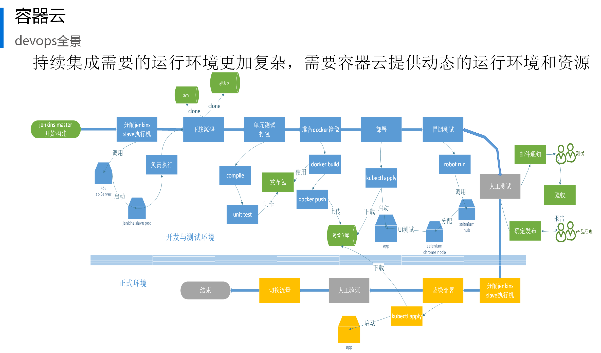
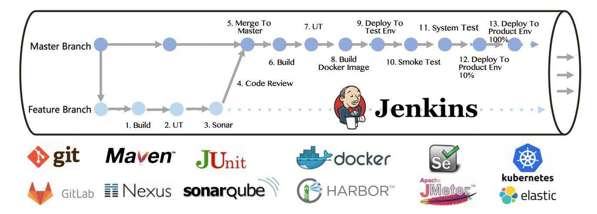

# **基于敏捷的软件质量体系(DevOps)**

在敏捷流程及互联网快速发布的需求下，基于敏捷的开发流程逐步成熟，DevOps体系的出现已经喊出了淘汰测试的口号，那么作为测试的未来如何发展，如何在DevOps体系中找到测试的定位？

## 1. DevOps生命周期
 

## 2. 知识栈
作为DevOps测试运维，其测试技能与运维技能都缺一不可，除了要负责需求的分析归纳，测试环境与生产环境的统一协调，还要解决测试脚本与构建平台的统一整合，确保测试能够在最短的时间内落地执行。

- 环境管理与监控：**Docker、Kubernetes、Ansible、Elk、Prometheus**

-版本管理：**Git、Gitlab**

-构建：**Maven、Nexus**

-测试：**pytest、Sonar、Selenium、Jmeter、Xunit**

 -发布：**Jenkins**
    
  

## 3. 测试运维为CI&CD保驾护航

     
匹配测试运维不分家的理念，将测试从狭小的单一领域与智能运维配合

- 优势一

解决测试人员缺乏环境搭建、部署及数据准备的种种弊端，脱离对运维人员的依赖

- 优势二

真正有效的将测试自动化，而不是简单的测试开发，编写测试脚本。

- 优势三

扩展测试所需要的业务及流程技能，将测试设计从用例设计上升到过程设计。

- 优势四

为测试架构打造良好的基础，拓展发布、监控、运维跟踪整理架构。
- 优势五

扩展测试所需要的业务及流程技能，将测试设计从用例设计上升到过程设计
- 优势六

测试运维基于敏捷DevOps体系，紧跟行业潮流。

