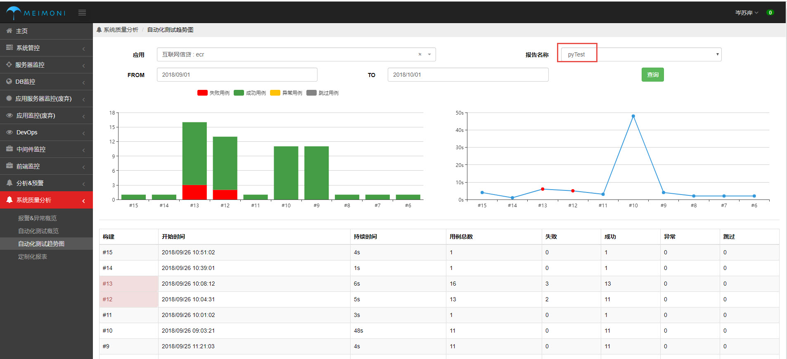

## **实施演示项目: Dev_PyTest**

### 1. 版本管理Git[链接](http://git.midea.com)
 
1. Git服务器地址 ```git.midea.com```
    - mip账号密码
2. 创建版本库

  ​      
### 2. 开发测试用例（pytest为例）

- clone 版本库
- 开发脚本并提交Git
 


### 3. 创建流水线
 
- 根据项目选择对应项目应用
- 点击新建流水线

### 3.1 创建节点[获取项目仓库]
 
1. stage名称 ：演示项目仓库
2. 类型：git_clone
3. Git Url: **http://git.midea.com/FinTest_2018/Dev_pytest**


### 3.2 创建stag[运行配置]


1. stage名称 ：运行并生成报告
2. 项目配置
    - 类型：**pytest**
    - 执行命令：```python run_test.py```
    - 报告名称：**pyTest**
    - 报告目录：**reports/**
    - 报告主页：**report.html**
    - 测试结果：**reports/report.xml**

### 3.3 执行并查看日志报告信息


1. 点击运行流水线
2. 点击查看构建过程.


 ### 4. 查看项目测试报表
 
 

这是查看项目运行任务的历史报告结果以及趋势
1. 选择对应的项目应用，点击查看自动化测试趋势
2. 选择报告名称，查看对应的任务详细情况

