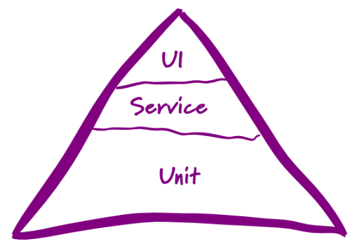

# 自动化测试分层

- UI自动化测试
- 接口自动化测试
- 单元自动化测试

# 测试向左移测试向右移

在项目中我们的一些测试实践
- 开发阶段
  - 新功能：我们应该做什么
  - 已有功能：如何自动化
- 产品阶段
  - 新功能：如何验证新功能带来用户价值
  - 已有功能：性能及可用性监控

- 开发阶段

  - 新功能： 单元测试, BDD, 探索性测试
  - 已有功能：自动化验证，性能测试，

- 产品阶段

  - 新功能：可用性测试
  - 已有功能：实时性能监控及用户反馈收集

## UI自动化测试

- 自动化工具- **Katalon_Studio**

- 自动化框架- **Selenium**

## 接口自动化

- 没有任何界面
- 函数或者方法
- 数据级别的判断
- 稳定性高

## 单元测试自动化

- 函数级别或者最小单元测试
- 一般由开发人员完成

## 分析结论

接口自动化测试是性价比较高的自动化测试手段

- 编程简单
- 功能稳定
