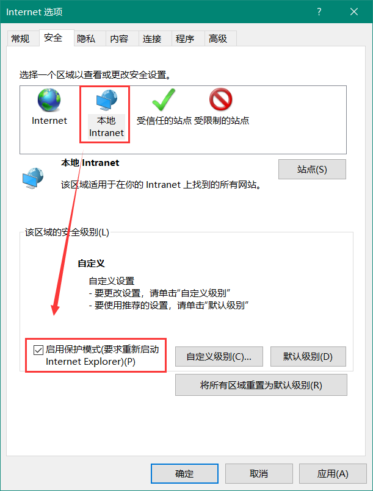

# UI自动化框架(katalon Studio)

## 一、工具简介

katalonstudio 是一款免费的自动化测试工具，可以安装在windows、macOS、linux操作系统上，基于selenium 和 Appium 测试框架，并集成了这些框架的优点。这个工具支持不同层次技能的测试开发人员使用，有很少编码经验的测试人员也可以很快的上手一个自动化测试项目，编码经验丰富的测试人员可以基于该工具做扩展，灵活的实现所需功能。

katalonstudio 是一个采用了 Selenium 为核心引擎的自动化测试解决方案。尽管它运用了一些 Selenium 的功能， 但是它不仅仅只是简单的将 Selenium 进行包装。katalonstudio 支持Web类型的自动化测试，它同时可以管理页面元素、测试数据、测试案例、生成自动化测试报告，只需要使用 katalonstudio 一个测试工具，就可以完成整个自动化测试流程。

## 二、环境支持

这个章节将帮助您正确地为katalonstudio准备环境。首先，需要确定您的计算机是否满足了能够正常使用katalonstudio的系统需求。

### 1、支持的系统

| 操作   系统 | Windows 7, Windows 8, Windows 10, macOS 10.11+, Linux (Ubuntu based) |
| ------- | ---------------------------------------- |
| CPU     | CPU的处理频率至少1 GHz 或者更高的 32-bit (x86) or 64-bit (x64) 的处理器 |
| 内存      | ***最少:*** 1 GB 内存 (32-bit) or 4 GB 内存 (64-bit)                                                                                      ***推荐*:** 4 GB 内存 (32-bit) or 8 GB内存 (64-bit) |
| 硬盘      | 最少1 GB可用硬盘空间，额外的磁盘空间需要依赖于项目源代码和生成的执行报告。  |

注意：在使用katalonstudio的过程中，可能出现弹出提示框框字体显示不全或者界面显示异常的情况。由于katalonstudio的默认字体大小设置了100%，为了确保你正常的使用katalonstudio，你当前的操作系统缩放与布局需要设置成为100%。

### 2、支持的浏览器及其版本

| 浏览器               | Windows支持版本 | macOS支持版本                                | 备注                                       |
| ----------------- | ----------- | :--------------------------------------- | :--------------------------------------- |
| Internet Explorer | 9, 10, 11   | 无                                        | IE浏览器需要配置：详情见**2.1Internet Explorer的配置** |
| Microsoft Edge    | 通用          | 无                                        | 需要根据官网获取最新Edge WebDriver [官网地址](https://docs.microsoft.com/en-us/microsoft-edge/webdriver) . |
| Firefox           | 56+         | 1.Firefox 57 以上版本；                         2.katalonstudio要求使用 v5.1以上版本 |                                          |
| Google Chrome     | 58+         | 无                                        |                                          |
| Opera             | 无           | 无                                        |                                          |
| Safari            | 5.1+        | 9,10,11                                  |                                          |

#### 2.1 Internet Explorer的配置

为了在Internet Explorer上正常运行自动化测试，您需要以下设置：

1.对于IE 7或更高的浏览器：启用保护模式必须与所有区域设置要一致（启用/不启用）。设置不一致则无法正常驱动IE浏览器报错：**<!--`Unexpected error launching Internet Explorer. Protected Mode settings are not the same for all zones.`-->**

通过以下路径设置：**Internet选项--安全--启用保护模式**（修改要求重新启动IE）；建议全部一致启用；

2.浏览器缩放百分比必须设置为100%；

3.必须禁用IE 10和更高IE版本的增强保护模式。通过以下路径设置：**Internet选项--高级--启用保护模式**（修改要求重新启动IE）；

4. IE11你需要在目标计算机上设置一个注册表条目，这样驱动程序就可以保持与它所创建的Internet Explorer实例的连接。

- 在开始-运行（win+R）输入“regedit”；进入注册表编辑界面；

  

- 定位到**FEATURE_BFCACHE** ，如果没有的话新建一项**FEATURE_BFCACHE** ；

  1. 32-bit 系统路径：**HKEY_LOCAL_MACHINE/SOFTWARE/Microsoft/Internet Explorer/Main/FeatureControl/FEATURE_BFCACHE.**
  2. 64-bit 系统路径： **HKEY_LOCAL_MACHINE/SOFTWARE/Wow6432Node/Microsoft/Internet Explorer/Main/FeatureControl/FEATURE_BFCACHE.**

- 在这个子键中，创建一个名为**iexplore.exe**的DWORD并且设置值为0；

  

## 三、工具的下载

katalonstudio为免安装程序，需要去官网下载该工具：[官网地址](https://www.katalon.com/)

1.进入官网下载，点击【Download】-->【Download now】

2.选择针对操作系统所需要的版本进行下载；

3.下载之后直接解压，进入主目录，点击katalon.exe运行。首次打开需要输入用户名和密码登录；在linux操作系统上，安装openjdk后，直接解压下载的安装包，使用命令行运行程序。（此说明文档使用Windows系统操作）

4.新建项目，点击**File--New--Project,**创建新项目；katalonstudio会自动初始化生成一系列的工程目录文件**；

