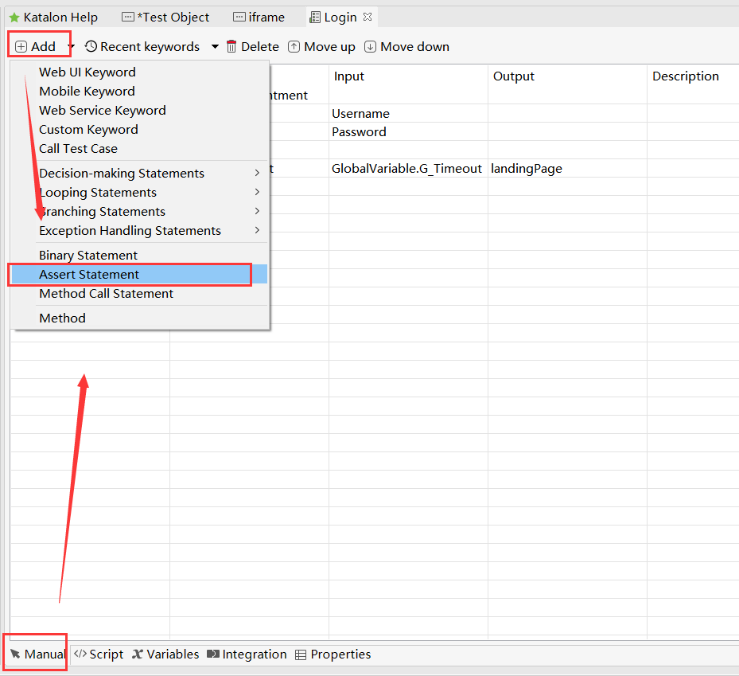
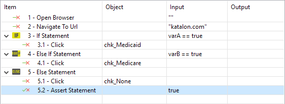
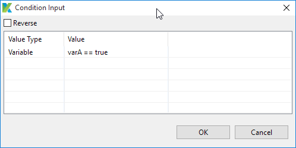
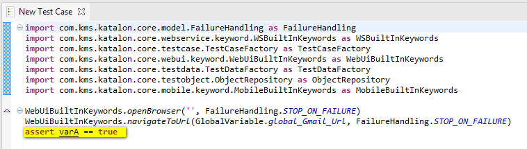
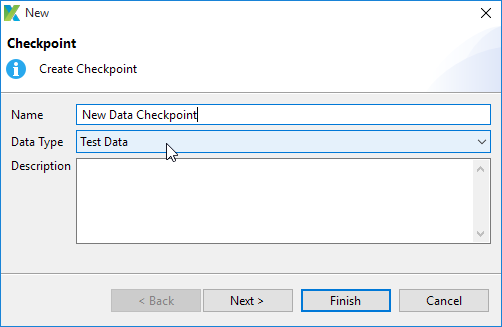
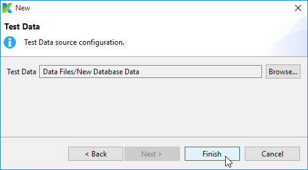
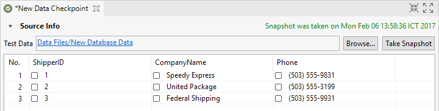
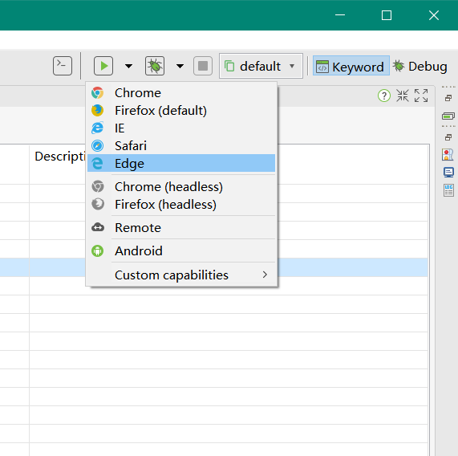
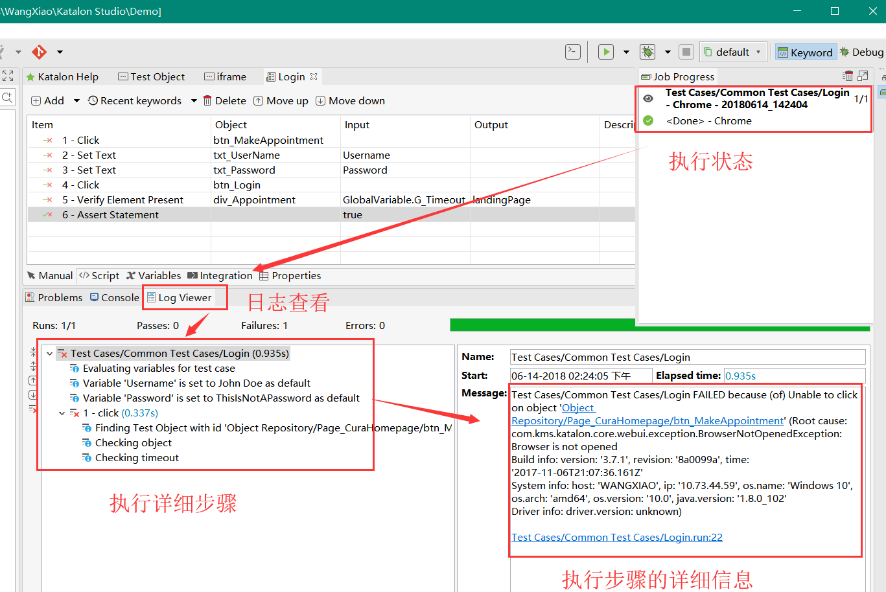
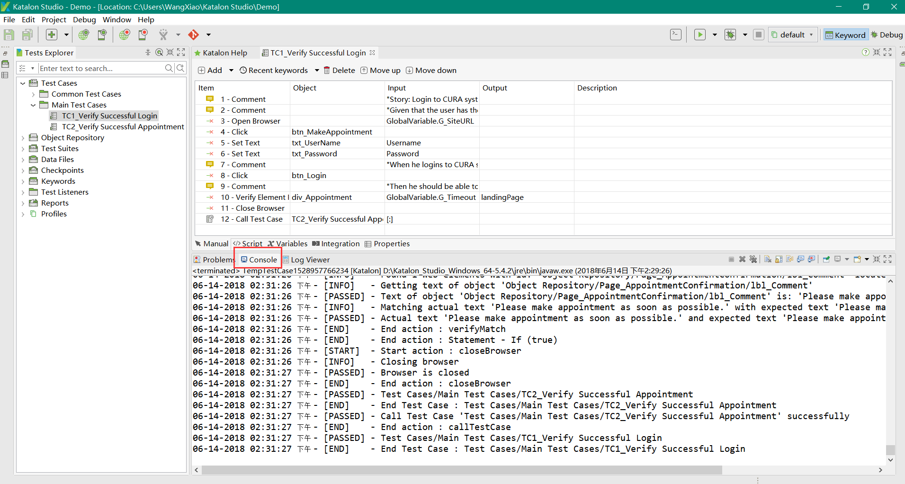

### 断言的用法

#### 8.1Manual 视图插入断言

katalonstudio支持在使用断言语句，assert语句包含一个布尔表达式，其中的条件必须保持true以便继续执行测试。因此，断言的执行如果表达式的计算结果为false，就会报告一个错误。

1.在Manual 视图中打开一个测试用例，然后从命令工具栏插入断言语句。

2.测试步骤表示assert表达式被添加到测试用例中。

3.双击输入单元格来编辑断言。

#### 8.2Scripting 视图插入断言

1.katalonstudio支持在测试用例的脚本视图使用Groovy或Java语言自定义和处理断言。

### 9、创建检查点

#### 9.1什么是检查点

检查点是在特定时间获取的测试数据的快照。一个检查点用来验证数据源的当前状态是否与之前的状态不同。检查点被证明是有帮助的一个例子是数据库验证案例，其中的值通常会不断变化。

1.在从主菜单中选择**File > New > Test Data** 菜单；新的检查点对话框将会显示出来。输入您的检查点的名称并选择Test Data作为数据类型。单击`Next`。

2.在下一个对话框中，单击Browse选择katalonstudio中定义的现有数据文件列表。单击Finish。

3.所选数据源的状态将被捕获并显示在下面的预览部分中。数据单元的复选框表明，在以后对该数据源的其他状态进行核实时，它们是否会被使用。完成以上操作并且保存。

### 10、执行测试案例

目前，katalonstudio支持在以下环境中执行自动化测试：

| 浏览器     | **描述**             |
| ------- | ------------------ |
| Chrome  | 谷歌浏览器              |
| Firefox | 火狐浏览器              |
| IE      | IIE浏览器             |
| Safari  | Safari浏览器          |
| Remote  | 远程环境中执行一个测试用例      |
| Android | Android设备上执行一个测试用例 |
| iOS     | iOS设备上执行一个测试用例     |
| Custom  | 自定义环境中执行一个测试用例     |

1.打开一个测试用例，然后选择web浏览器（Chrome、Firefox、IE、Safari或Edge）来运行主工具栏运行命令的测试用例。

### 11、执行日志查看

选择浏览器执行完毕以后，可以在Log Viewer标签查看执行日志；

同时可以在Console Viewer标签查看执行日志；

