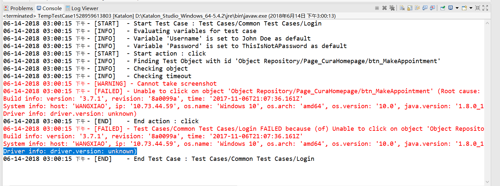
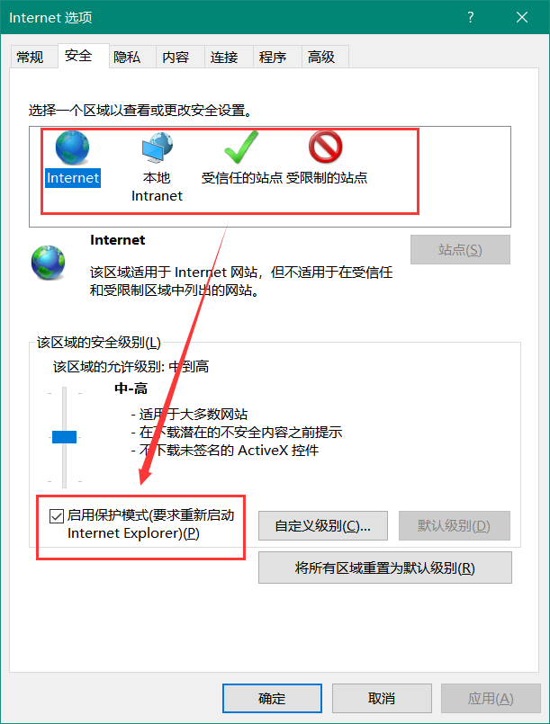
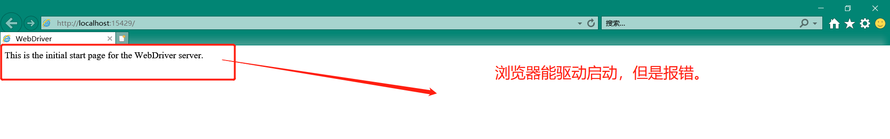

## 常见问题解决方案

1.浏览器驱动不存在或者遭受破坏，执行案例的时候报错；报错信息：`Driver info: driver.version: unknown)`

需要下载浏览器驱动并且放到以下路径：`\Katalon_Studio_Windows_64-5.4.2\configuration\resources\drivers\chromedriver_win32`

2.IE 浏览器：启用保护模式必须与所有区域设置要一致（启用/不启用）。设置不一致则无法正常驱动IE浏览器报错：**<!--`Unexpected error launching Internet Explorer. Protected Mode settings are not the same for all zones.`-->**

通过以下路径设置：**Internet选项--安全--启用保护模式**（修改要求重新启动IE）；建议全部一致启用；

3.IE 浏览器缩放比例没有设置成100%，报错信息如下：`***Unexpected error launching Internet Explorer. Browser zoom level was set to 125%. It should be set to 100%***`

