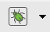
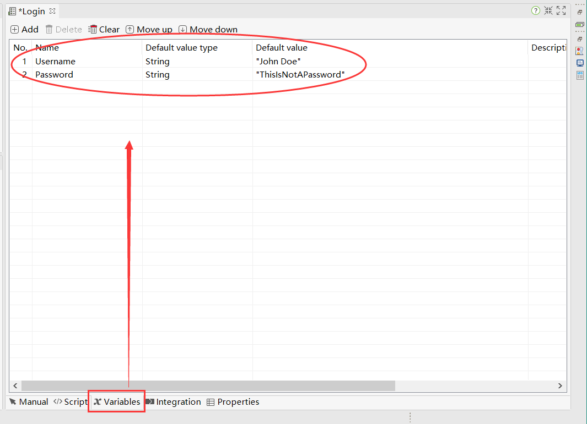

## 框架简述

### 1、katalonstudio界面简述：

#### 1.1工具栏操作按钮介绍

主工具栏包含您通常执行的最常见的操作（例如，创建测试资源或执行自动化测试）。

| 图标                                       | 功能描述                           |
| ---------------------------------------- | ------------------------------ |
|  | 停止当前执行                         |
|  | 保存当前打开的测试文件                    |
|  | 保存所有当前打开的测试文件                  |
|  | 执行当前的测试用例，可以通过下拉列表选择需要驱动执行的浏览器 |
|  | WebUI测试用例录制功能                  |
|  | WebUI测试用例界面元素捕捉工具              |
|  | 移动端测试用例录制功能                    |
|  | 移动端测试用例界面元素捕捉工具                |
|  | 控制台执行生成命令命令的构建器                |
|  | 从JIRA导入文件                      |
|  | 选择执行测试用例的时候需要的配置文件             |
|  | 调试当前打开的测试用例。                   |
|  | 创建新的文件（测试用例，测试对象，测试套件，测试数据等）   |
|  | GitHub/GitLab集成项目管理插件          |

### 2、Tests Explorer视图：

Tests Explorer视图，也就是项目初始化后展示的主要界面；允许您浏览项目的结构并快速访问所有测试工件。使用视图上的上下文菜单，您可以创建新的工件，组织视图的项目，或者在需要时将它们拖放到特定的编辑器视图中。

#### 2.1目录文件简述；

- **Test Cases**  *测试用例->当前项目中的所有测试用例;*
  - **Common Test Cases**  *公共测试用例*
  - **Main Test Cases**  *主要测试案例*
- **Object Repository**  *界面元素->当前项目的所有测试对象;*
- **Test Suites**  *测试套件->当前项目的所有测试套件和测试套件集合;*
- **Checkpoints**  *测试检查点->当前项目的所有测试案例的检查点；*
- **Data Files**  *测试数据文件->当前项目的所有测试数据;*
- **Keywords**  *关键字函数->当前项目所有编写的关键字；*
- **Test Listeners**   *测试监听->当前项目的所有测试监听；*
- **Reports**  *测试报告->当前项目的所有生成报告*
- **Profiles **  *配置文件-->当前项目的所有配置文件*
  - **default**   *默认配置文件*

### 3、关键字视图：

1.关键字浏览视图,该试图显示了katalonstudio支持的所有可用关键字。在编写脚本时，您可以将关键字拖放到测试用例编辑器中。

2.打开关键字视图，在编辑案例的时候可以直接拖动需要使用的关键字到案例中；

### 4、测试用例编辑器

当您新建一个用例或者打开一个测试用例时，它的详细信息会显示在包含以下选项卡的编辑器中：

- Manual tab   通用编辑视图
- Script tab   脚本编辑视图
- Variables tab   变量编辑视图
- Integration tab  集成工具编辑视图
- Properties tab   属性选项视图

#### 4.1Manual tab模式

通用编辑模式，该编辑视图下可以通过操作方法名称检索并且选择需要使用的操作方法，也可以结合左树列关键字试图直接拖动需要使用的关键字到测试案例中；

##### 4.1.1通过索引选择关键字

##### 4.1.2通过关键字视图选择关键字

#### 4.2Script tab模式

该编辑模式显示了对应的脚本视图，其中有编程基础的操作用户可以使用Groovy或Java语言轻松直接新增、修改、删除测试脚本。保存以后直接生成对应操作步骤的测试案例。

#### 4.3Variables tab模式

该编辑视图显示为测试用例定义的所有公共变量，可以通过该界面定义所有变量的默认参数；在该界面新增的变量赋值以后，在执行该案例的时候读取的变量的数据为该部分所输入的数据；

#### 4.4Integration tab模式

该编辑视图显示为你的测试用例与qTest的集成的信息显示在这个视图中。

#### 4.5Variables tab模式

选项卡中显示关于测试用例的一般信息。

描述：用户可以添加或编辑该字段，以提供关于测试用例的详细信息。

注释：这个字段是只读的。内容从测试用例中的Comment关键字中提取并填充。业务用户可以通过提供需求来利用评论字段来参与开发过程。下面的例子展示了一个测试用例执行步骤的描述，以及输出执行结果；

