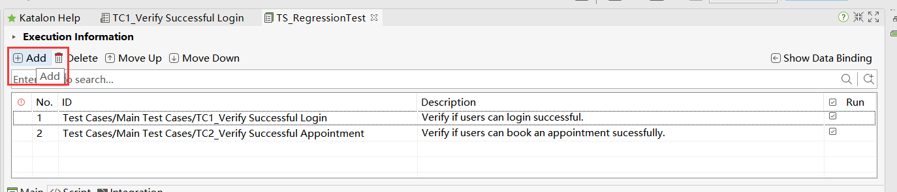
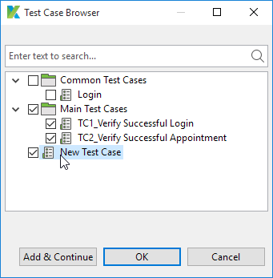
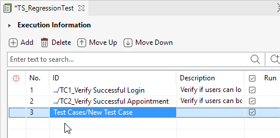
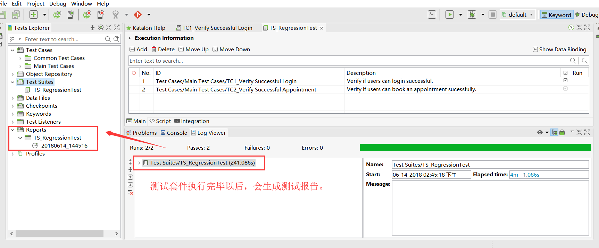
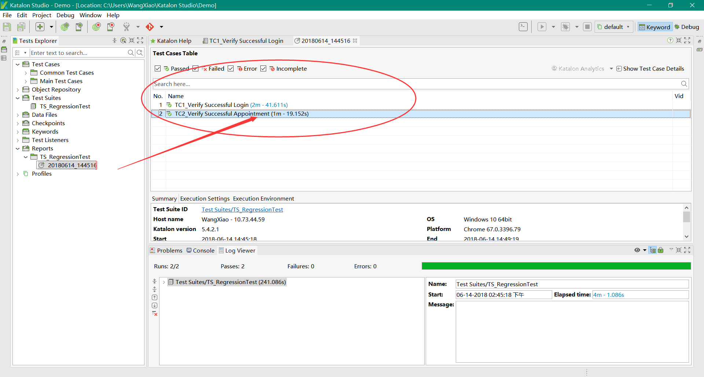
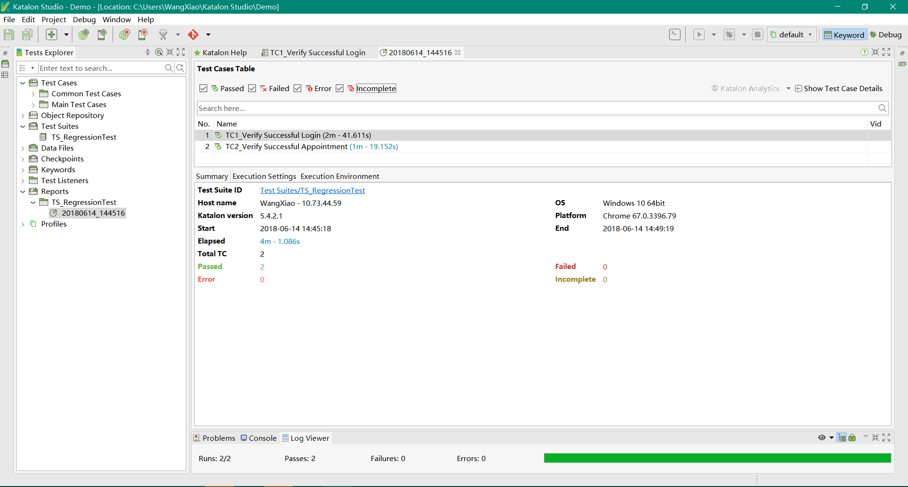
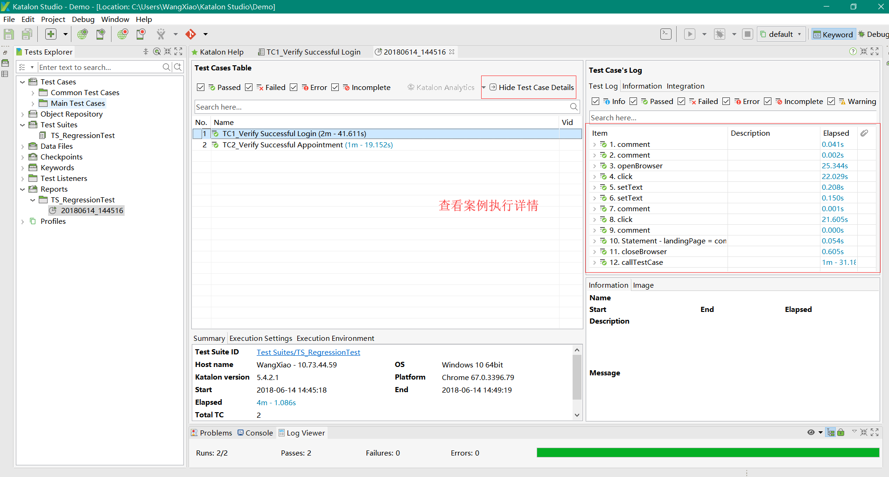

### 12、创建测试套件

katalonstudio支持新增套件，然后把需要执行的测试用例全部增加到测试套件中一次性执行。

### 13、测试套件新增用例

通过使用测试套件编辑器，可以通过以下步骤将需要执行的测试用例添加到测试套件中：

1.打开一个测试套件，然后选择从命令工具栏中添加Add Test Case的选项。

2.katalonstudio中的所有测试用例都显示在测试用例浏览器对话框中。选择需要执行的，然后单击OK。

3.所选的测试用例将相应地添加到测试用例列表中。

### 14、输出测试报告

1.一旦测试套件完成了它的执行，就会自动生成一个历史报告并存储在报告中。

2.查看案例执行详细情况；

