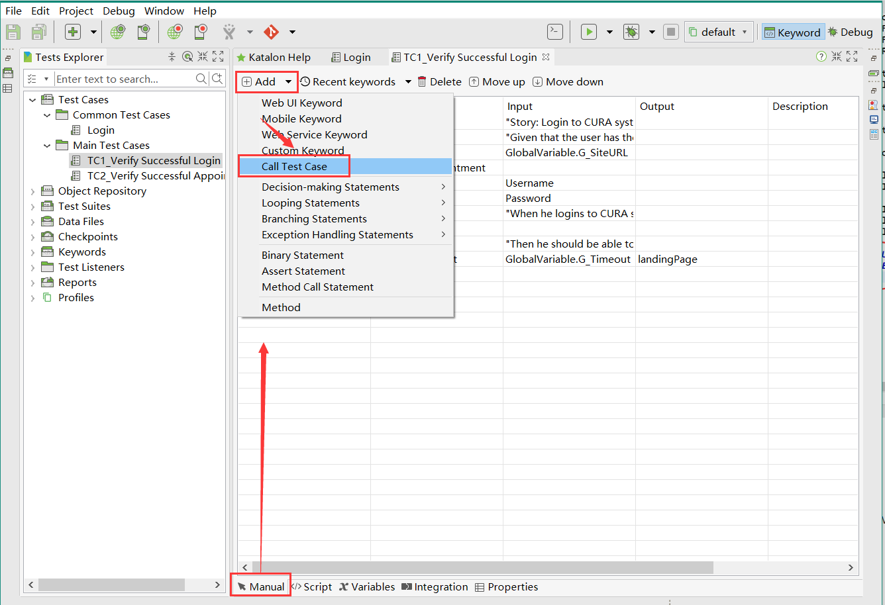

## 测试案例

### 1、新建项目

打开 katalonstudio工具，点击**File--New--Project,**创建新项目；katalonstudio会自动初始化生成一系列的工程目录文件；操作详情见下列动图**：

### 2、新建测试用例

#### 2.1通过Record Web录制测试用例

对于初学者、或者没有编码基础的操作人员可以通过`Record Web`功能自动录取测试脚本。录取结束以后可以直接回放实现执行测试案例；

如果是简单的操作流程，完全可以用`Katalon`自带的`Record Web`功能进行录制回放实现自动化案例，详见如下动图：

- 新建测试案例
- 打开`Record Web`
- 输入需要打开的网址
- 驱动Chrome浏览器
- 点击`Start`
- 打开百度首页
- 在输入框里输入katalon
- 确认搜索
- 展示搜索结果

注意：*`Record Web`功能会把你对浏览器做的所有操作，全程录制并保存起来，当然如果有需要，也可以按自己的需求对录制好的步骤做一些调整。如多在录制的过程中对浏览器执行了多余的业务流程操作，需要手动对该部分操作步骤进行删除；*

#### 2.2通过Spy Web功能添加对象

##### 2.2.1手动抓取界面元素

新建Demo操作步骤如下（该部分使用Chrome浏览器）：

- 点击`Spy Web`
- 输入需要打开的网址
- 选择驱动Chrome浏览器
- 点击`Start`
- 打开百度搜索首页
- 定位搜索框，将其捕获（按组合键`Alt+ ~`）
- 确认捕获的元素
- 将搜索框保存到对象仓库中
- 查看捕获的所有信息

`Spy Web`的作用是可以在较为复杂的页面上或者当操作人员不会写代码需要操作元素时，用`Spy Web`可以非常方便的手动抓取到。上述所有步骤的动图如下：

##### 2.2.2新建测试用例

通过`Spy Web`手动抓去了界面操作元素以后，需要将界面元素和操作方法结合，才能形成一个测试案例的操作步骤。该部分操作的过程无需再打开浏览器，只要将抓取的界面元素和操作方法步骤结合起来就可以形成一个测试案例；

- 新建测试案例，命名
- 点击`Add`
- 选择`Web Ui Keyword`
- 输入`Open Browser`，输入网址连接
- 打开百度首页
- 在输入框里输入katalon
- 确认搜索
- 展示搜索结果

过程动图如下（整个过程中并没有对Chrome做任何人工操作）：

#### 2.3通过Script视图编辑脚本

如果你有一定的编程基础，也可以通过直接编辑脚本视图，直接通过写脚本实现自动化测试用例；

比如在上述用例的基础上，我有如下需求变更：

- 我希望用户点击`搜索`按钮，而不是直接通过敲击`回车`完成搜索
- 我希望在搜索结果出来之后，自动打开搜索结果的第一项

以上变更实现方式通过脚本编辑视图直接进行修改；

具体过程如下：

- 手动创建按钮对象`btnSearch`
- 替换【2.1通过Record Web录制测试用例】中`searchByRecord`实验中的回车事件，将其变为点击`btnSearch`
- 点击一个搜索结果，不必深究第一个搜索结果的元素是什么，因此通过`Spy`找到元素的`XPath`值
- 用`XPath`值创建搜索结果的链接对象
- 在脚本代码中加入`WebUI.click`触发点击事件

整个实现过程如动图所示：

### 3、通用视图调用方法

1.打开或者新建测试用例在用例编辑管理器界面 **Manual** 视图中，点击【Add-Method Call Statement】调用方法；

2.方法调用的测试步骤被添加到测试用例中。

3.双击输入单元格来编辑被调用的方法，编辑后保存。

备注：一旦测试步骤被添加为方法调用语句，它将不被允许更改为另一个关键字。

### 3、脚本编辑视图调用方法

1.测试用例的脚本视图允许您使用Groovy或Java语言轻松地定义和处理方法调用。例如：

### 4、用例执行报错处理机制

katalonstudio在执行用例的时候中断故障处理机制，允许用户决定否会继续运行；目前提供的处理方式有：

| Stop on Failure         | 执行案例报错以后，执行中断，停止继续运行；                    |
| ----------------------- | ---------------------------------------- |
| **Optional**            | **尽管在执行过程中出现了任何错误，katalonstudio仍将继续。带有错误的步骤将具有警告状态；** |
| **Continue on Failure** | **尽管在执行过程中出现了任何错误，katalonstudio仍将继续。带有错误的步骤将会失败；** |

#### 4.1工具配置上统一设置处理模式

按照以下步骤定义在整个项目中应用失败处理的默认行为：

在katalonstudio中基本配置设置： **Project > Settings > Test Case**.

故障处理的默认行为选择首选的选项。完成后单击OK。

#### 4.2针对单个用例设置处理模式

在通用案例编辑视图（Manual View），案例执行步骤中右键点击你想要改变失败处理行为的步骤来触发它的上下文菜单；选择以后点击保存生效；

#### 4.3脚本编辑视图设置处理模式

对于katalonstudio中的所有内置关键字，您可以将failure操作添加为最后一个参数。在脚本模式中编辑关键字时，请使用其中任何一个选项来指定其行为。

例如：

### 5、公共内容的调用

#### 5.1调用测试用例

1.在通用模式（Manual  Veriw）调用测试用例；按照下面的步骤，在Manual  Veriw中调用另一个测试用例：

2.测试用例浏览器对话框将显示项目中所有现有的测试用例。选择要调用的测试用例并单击OK。

3.测试用例步骤将被添加到上面所选的测试用例中作为它的目标。

#### 5.2自定义关键字

katalonstudio除了内置的关键字之外，用户还可以自定义关键字来扩展katalonstudio的功能。定制关键字就可以像其他内置关键字一样实现测试用例中调用。

##### 5.2.1创建一个包

创建包是为了存储关键字，一个包允许您将定制的关键字分组到不同的类别中。**File > New > Package**

##### 5.2.2创建一个关键字

1.新建关键字，在新的关键字对话框输入关键字的名称，并为关键字指定一个包。单击OK。

**File > New > Keyword**

2.一个新的关键字将相应地在指定的包下创建。

3.编辑关键字内容，然后点击保存，如下图所示:

##### 5.2.3新建关键字的调用-Manual view

1.在通用编辑用例视图中打开一个测试用例，然后选择从命令工具栏中添加自定义关键字。

2.一个新的测试步骤被添加到所有已定义的定制关键字的列表中。在这里选择你最近创建的关键字。

##### 5.2.4新建关键字的调用-Scripting view

按照下面图片所示的步骤，在测试用例的脚本视图中使用您定义的定制关键字：

### 6、变量和数值的管理

#### 6.1变量类型

在katalonstudio中有三种类型的变量，如下所示：

| **类型**           | **描述**                    |
| ---------------- | ------------------------- |
| Private variable | 一个私有变量只能在它被定义的测试用例的范围内引用。 |
| Local Variable   | 公共变量可以作为测试用例的参数公开。        |
| Global Variable  | 一个全局变量可以在您的项目的任何地方引用。     |

##### 6.1.1私有变量

在测试用例的脚本视图中定义的变量被划分为private变量。这些变量只能在Groovy类的范围内访问。例如:

##### 6.1.2公共变量

1.你可以使用测试用例编辑器中的Variables选项卡来管理测试用例的公共变量列表。切换到测试用例的变量选项卡。然后单击Add。

2.一个新的行被添加到变量列表中。修改变量细节，并在完成后保存测试用例。

备注：

在这个列表中定义的变量可以用作其他配置中的测试用例的参数。（例如，在用于测试执行的绑定数据时，在手动视图或params中输入关键字的输入数据）

##### 6.1.3全局变量

1.你可以使用全局Variables视图来管理项目中的全局变量列表。展开全局变量视图。然后单击Add。

2.新的变量对话框将显示出来。指定变量的详细信息，然后单击OK。

3.该变量将相应地添加到全局变量列表中。

备注：

- **以上操作方式适用于5.3版本以及以下；**
- **5.4版本和以上全局变量优化全局配置文件调用；**

#### 6.2数值类型

在katalonstudio设计自动化测试时，用户通常需要为特定的测试步骤配置数据，比如：

将输入参数传递给测试步骤。从测试步骤获取输出值。你可以从katalonstudio支持的广泛的值类型中进行选择，如下所示：

| 类型              | 描述                                     |
| --------------- | -------------------------------------- |
| Boolean         | 数据是一个布尔值，可以从布尔表达式中求值。                  |
| Constant        | 数据是一种不会随时间改变的值。                        |
| Dictionary      | 数据是键和值的集合。                             |
| Global Variable | 数据是在执行过程中可能会更改的值。这种类型的数据可以在项目的任何地方引用。  |
| List            | 值列表。                                   |
| Method Call     | 方法调用数据。                                |
| Property        | 对象的公共属性值                               |
| Test Case       | 测试案例                                   |
| Test Data       | 测试数据                                   |
| Test Data Value | 数据是来自测试数据文件的值。                         |
| Test Object     | 数据是一个测试对象。                             |
| Variable        | 执行过程中可能会更改的值。这种类型的数据只能在定义它的测试用例的范围内引用。 |
