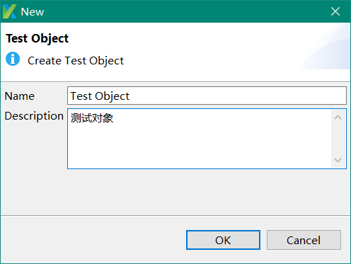
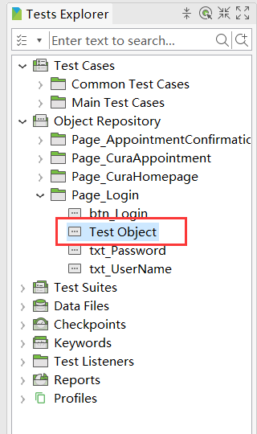
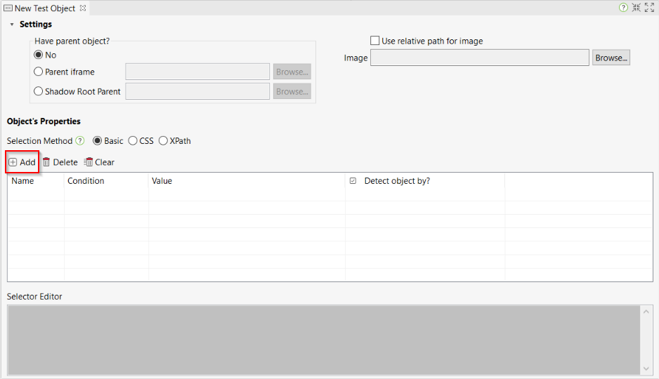
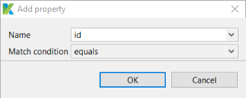
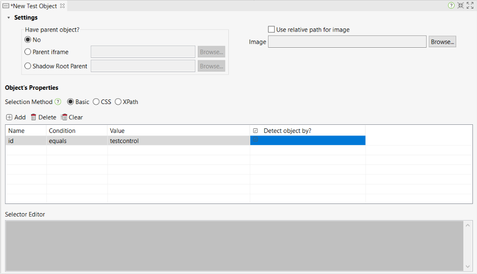
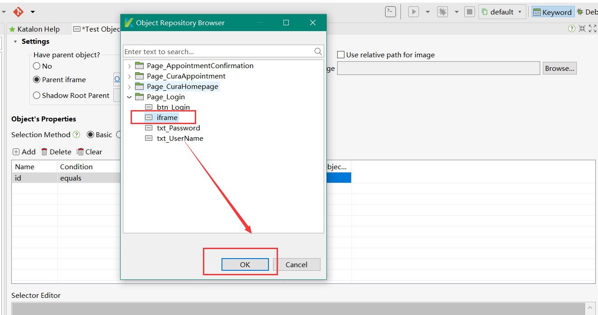
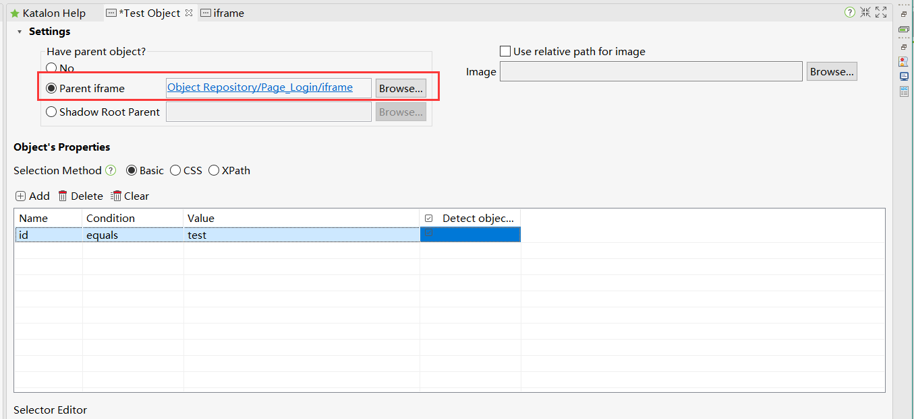

### 测试对象的管理

#### 7.1创建测试对象

1.在主菜单中选择路径**File > New > Test Object** 新的测试对象对话框将会显示出来。

2.为新的测试对象提供名称，然后单击OK按钮。在katalonstudio的对象存储库中创建了一个新的测试对象。

#### 7.2添加测试对象属性

1.在Test Object编辑器中，单击Add命令。

2.弹出Add property对话框。

3.属性内容：

| Field           | Description                              |
| --------------- | ---------------------------------------- |
| Name            | 提供了一些常见的选项（xpath、css、class、id、title），或者如果需要，可以手动输入。 |
| Match condition | 用于在测试的应用程序中搜索“实际”对象的条件数值                 |

4.新属性将按照指定的属性添加到属性列表中。在执行自动化测试时，提供用于在测试应用程序中搜索“实际”对象的值。

#### 7.3测试元素增加父窗体-iframe

1.在元素定位的过程中，有许多web应用程序在iframe中呈现元素。因此，需要设置脚本如何遍历一个网站的iframe，并选择正确的iframe，其中的文本和它的对象是存在的。为了做到这一点，你必须在与元素交互之前使用“切换到Frame”关键字。

2.katalonstudio支持在test object view中定义父框架对象的能力，所以你只需要选择父窗体，并且执行将自动切换到iframe。

3.选择成功，保存。

