## 测试环境搭建


### Python选择

如果你是第一次接触Python，一定会迷惑Python为什么会提供Python2.x 和 Python3.x两个版本？那么，直接使用Python3.x的最新版本就好了。因为Python2.x预计到2020年不在维护。注：Python3以后版本不再向Python2进行兼容。

### Python下载

打开 [Python官网](https://www.python.org/)，找到“Download”, 在其内容下找到【Latest】直接点击链接：[Python 3.6.4](https://www.python.org/downloads/release/python-364/) 进入下载界面； 根据列表中选择自己的平台（Windows/Mac）,一般的Linux平台已经自带的Python，所以不需要安装，通过打开“终端” ，输入“python”命令来验证是否已经安装。本文以Windows平台安装为例。


如果你是Windows平台用户，会遇到一个版本为什么会提供多种个下载链接。例如：

**Python 3.6.4 - 2017-12-19**

- Download Windows x86 web-based installer

- Download Windows x86 executable installer

- Download Windows x86 embeddable zip file

- Download Windows x86-64 web-based installer

- **Download Windows x86-64 executable installer**

- Download Windows x86-64 embeddable zip file

- Download Windows help file

  相应解析：

  ------

  Windows x86 只支持32位的系统；

  Windows x86-64 支持64位的系统；

  web-based 格式文件在安装的过程中需要联网；

  executable 格式文件可执行文件(.exe)方式安装；
  embeddable zip file 嵌入式版本，可以集成到其它应用中。

  ------

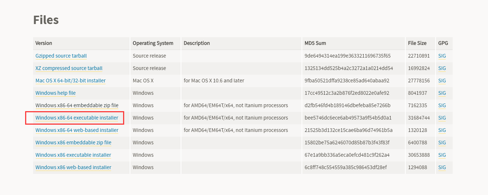

### Python安装

下载到本地双击安装，这里以 【自定义安装】 为例。安装python的时候需要勾选“Add Python 3.x to PATH” ：

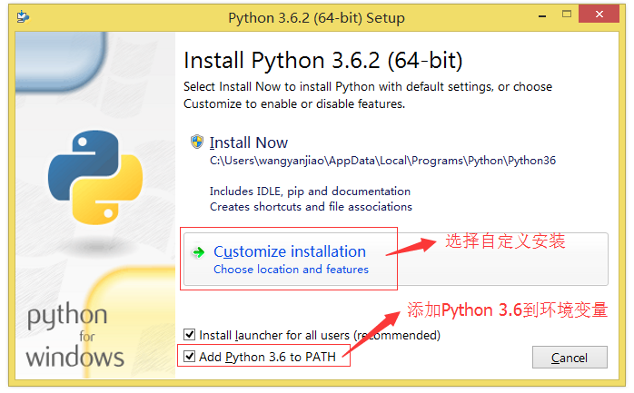

如果没有特殊需求，就全选上。**注意：pip要勾选**，这样下面安装selenium的时候就不用再单独安装；

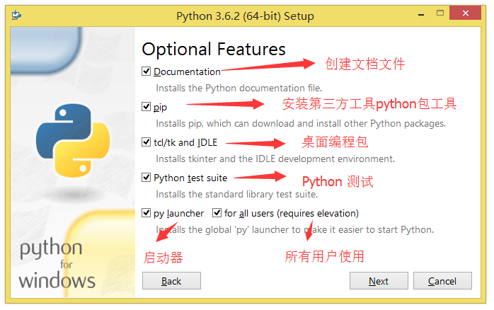

若选中【Install for all users】安装目录会改变，请根据自己的需求修改安装路径再点击 【Install 】进行下一步：

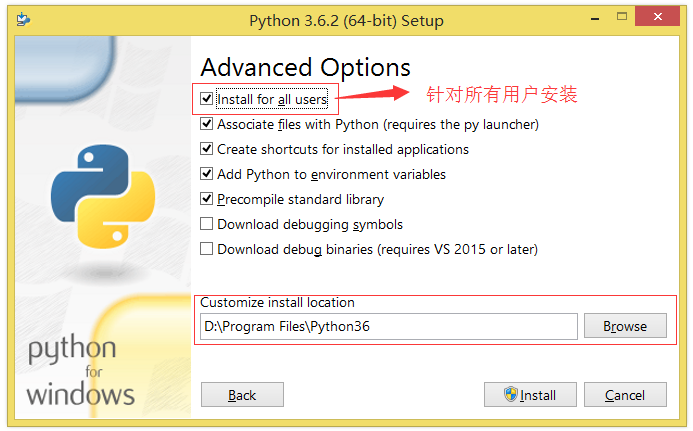

安装中...

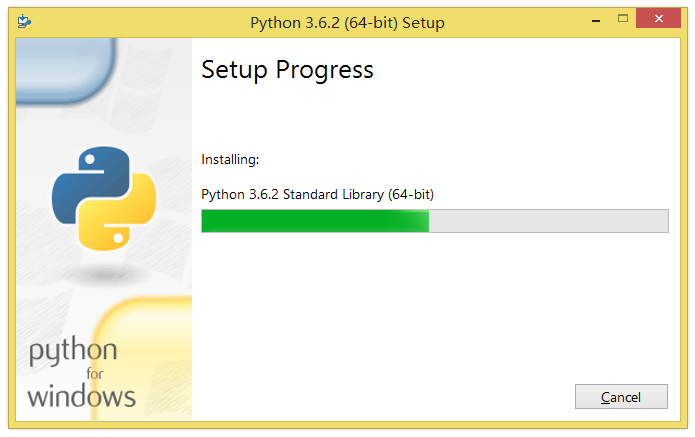

安装完成！

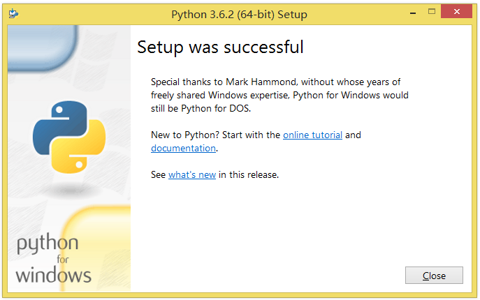

### 环境变量配置

注意：在安装的过程中需要勾选：“Add Python 3.x to PATH” , 如果没有勾选，需要在安装完成之后，将Python的安装目录（如：C:\Python36）添加到环境变量PATH下面。可以通过以下方式设置：

- 右键点击"计算机"，然后点击"属性"
- 然后点击"高级系统设置"
- 点击“环境变量”
- 选择"系统变量"窗口下面的"Path",双击即可！
- 然后在"Path"行，添加python安装路径即可(我的D:\Python35)，所以在后面，添加该路径即可。

安装完成后，打开Windows命令提示符（cmd）/
## Selenium安装
### 通过pip安装

安装selenium前需要确保python安装成功，并且已经安装了pip。安装 pip 的好处是可以使用 pip 命令方便地安装 Python 第三方库。在通过 pip 安装 Python 第三方库时，如果只输入包名，则默认安装当前库中最新的版本，如果我们不想安装最新版本的包，则可以在包名后面加版本号。通过以下方法确认pip是否已经安装成功：

在Windows命令提示符（cmd）终端输入：
```
pip install selenium==3.4.2 //指定版本号安装
pip install selenium==3.4.2 //指定版本号安装
pip show selenium //查看当前包的版本信息
```
## 浏览器驱动安装

### 浏览器驱动下载

当官方selenium升级到3.0之后，对不同的浏览器驱动进行了规范。如果想使用selenium驱动不同的浏览器，必须单独下载并设置不同的浏览器驱动。

- Firefox浏览器驱动：[geckodriver](https://github.com/mozilla/geckodriver/releases)
- Chrome浏览器驱动：[chromedriver](https://sites.google.com/a/chromium.org/chromedriver/home)
- IE浏览器驱动：[IEDriverServer](http://selenium-release.storage.googleapis.com/index.html)
- Edge浏览器驱动：[MicrosoftWebDriver](https://developer.microsoft.com/en-us/microsoft-edge/tools/webdriver)
- Opera浏览器驱动：[operadriver](https://github.com/operasoftware/operachromiumdriver/releases)
- PhantomJS浏览器驱动：[phantomjs](http://phantomjs.org/)
注：部分浏览器驱动地址需要科学上网。

### 设置浏览器驱动

设置浏览器的地址非常简单。 我们可以手动创建一个存放浏览器驱动的目录，如： C:\driver , 将下载的浏览器驱动文件（例如：chromedriver、geckodriver）丢到该目录下。

我的电脑–>属性–>系统设置–>高级–>环境变量–>系统变量–>Path，将“C:\driver”目录添加到Path的值中。
- Path
- ;C:\driver

### 浏览器验证

验证不同的浏览器驱动是否正常使用。（**需要安装脚本编辑器，该部分可以在本文末端一起执行**）

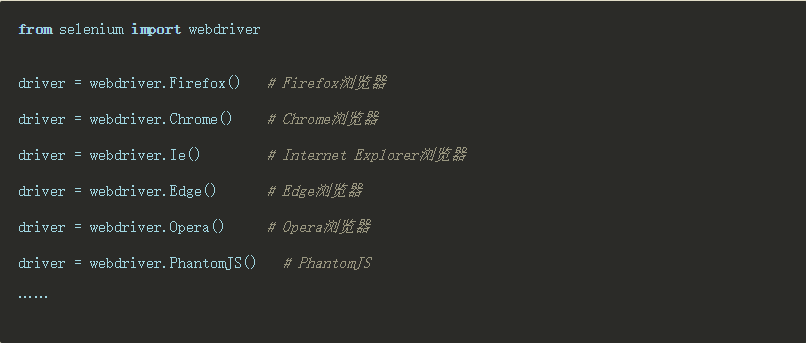

## 4.脚本编辑器安装

### Atom简介

Atom是专门为程序员推出的一个跨平台文本编辑器。具有简洁和直观的图形用户界面，并有很多有趣的特点：支持CSS，HTML，JavaScript等网页编程语言。它支持宏，自动完成分屏功能，集成了文件管理器。

Atom编辑器上手简单，零门槛，开源免费，资源占用不高，自身支持的功能就挺多，配置起来也很方便，还有很多插件可以选择，支持中文。

### Atom下载

进入[atom](https://atom.io/)的官网；


根据系统类型选择安装包包，本文针对widows平台安装，点击下载，根据个人需求选择存储路径；

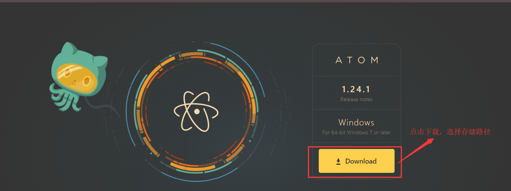

### Atom安装

双击AtomSetup-x64.exe直接运行默认安装，显示以下界面表示安装完成：


### Atom配置及插件安装

安装完成Atom以后，我们需要集成python开发环境，所以需要配置一下工具，并且安装一些日常使用可以提高工作效率的插件；

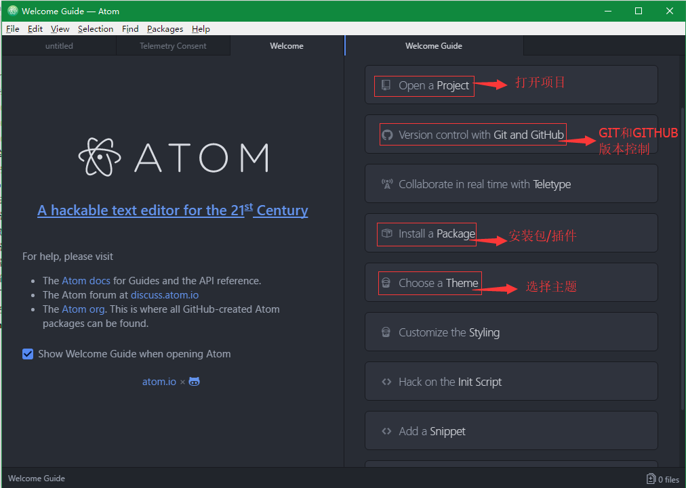

安装【atom-runner】包，点击【Install a Package--Open Install】,进入搜索界面；


输入“atom-runner”搜索，然后点击安装即可。如下图所示：

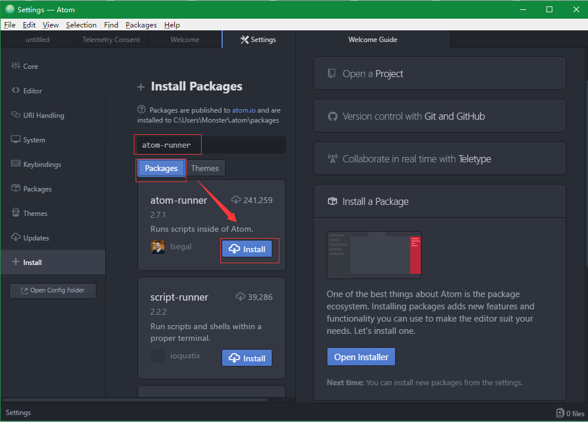

安装【atom-python-run】（针对windows系统运行python），输入“atom-python-run”搜索，然后点击安装即可。如下图所示：

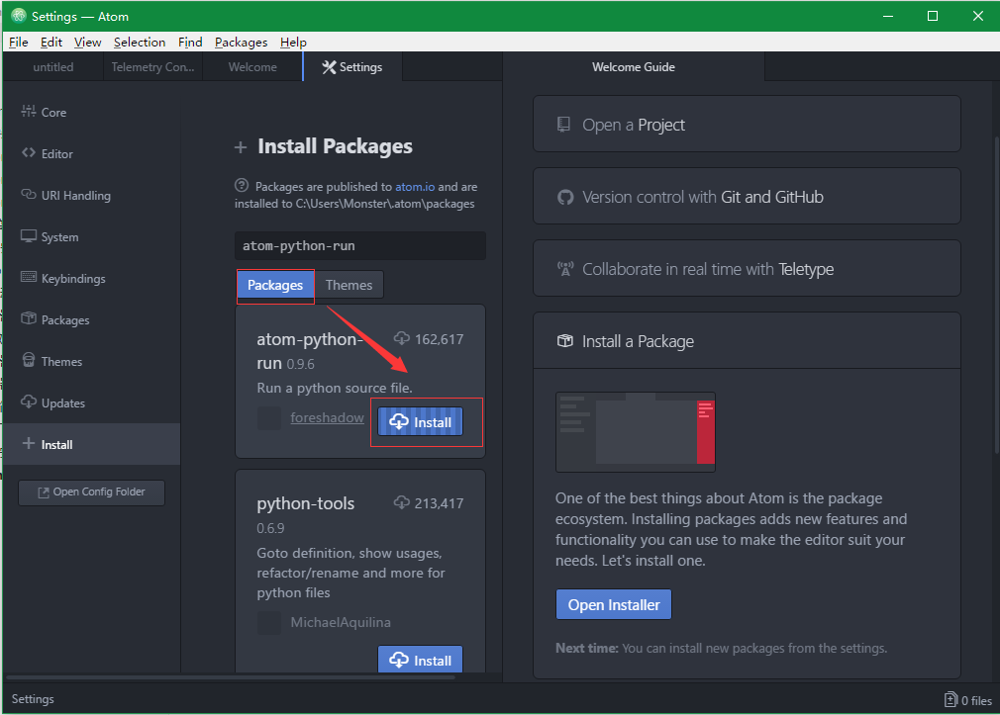

以下为选装插件包，可以根据个人喜好安装：

- 自动补全：autocomplete-python
- 语法检查：linter-flake8
- 定义跳转：python-tools
- 调试工具：python-debugger

### 编写每一个脚本

```
from selenium import webdriver
driver = webdriver.Chrome()
driver.get("https://www.baidu.com")
driver.find_element_by_id("kw").send_keys("Selenium2")
driver.find_element_by_id("su").click()
driver.quit()
```
