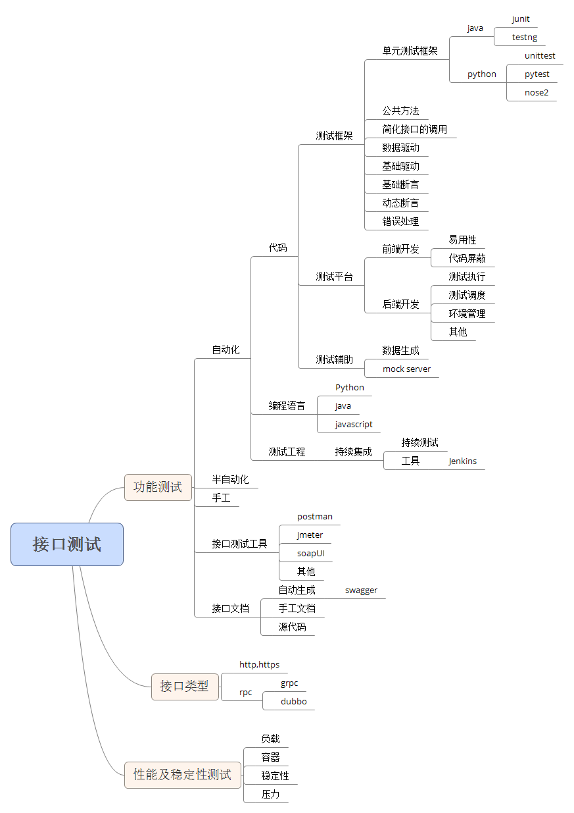

# 简介

### 如何查看python request 文档
[官方教程](http://cn.python-requests.org/zh_CN/latest/)

### API自动化测试知识体系

- 熟练使用一门语言(python/java/javascript)
- 接口协议 HTTP webservices Dubbo websocker
- 库 request
- 测试框架unittest/pytest/junit
- 持续集成 jenkins

