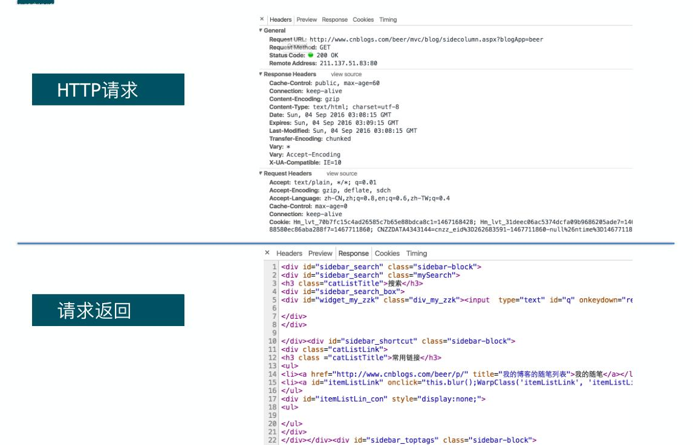

## Web接口
### HTTP协议
>超文本传输协议（HTTP，HyperText Transfer Protocol)是互联网上应用最为广泛的一种网络协议。

#### HTTP 协议的主要特点可概括如下：
1. 支持客户/服务器模式。
简单快速：客户向服务器请求服务时，只需传送请求方法和路径。请求方法常用的有 GET、POST。每种
方法规定了客户与服务器联系的类型不同。由于 HTTP 协议简单，使得 HTTP 服务器的程序规模小，因而通
信速度很快。
2. 灵活：
HTTP 允许传输任意类型的数据对象。正在传输的类型由 Content-Type 加以标记。
3. 无连接：
无连接的含义是限制每次连接只处理一个请求。服务器处理完客户的请求，并收到客户的应
答后，即断开连接。采用这种方式可以节省传输时间。
4. 无状态：
HTTP 协议是无状态协议。无状态是指协议对于事务处理没有记忆能力。缺少状态意味着如果后续处理需要前面的信息，则它必须重传，这样可能导致每次连接传送的数据量增大。另一方面，在服务器
不需要先前信息时它的应答就较快。

######  HTTP 请求类型：

请求行以一个方法符号开头，以空格分开，后面跟着请求的 URI 和协议的版本，格式如下：MethodRequest-URI HTTP-Version CRLF
其中 Method 表示请求方法；Request-URI 是一个统一资源标识符；HTTP-Version 表示请求的 HTTP
协议版本；CRLF 表示回车和换行（除了作为结尾的 CRLF 外，不允许出现单独的 CR 或 LF 字符）。
请求方法（所有方法全为大写）有多种，各个方法的解释如下：
请求方法 说明
```
GET 请求获取 Request-URI 所标识的资源
POST 在 Request-URI 所标识的资源后附加新的数据
HEAD 请求获取由 Request-URI 所标识的资源的响应消息报头
PUT 请求服务器存储一个资源，并用 Request-URI 作为其标识
DELETE 请求服务器删除 Request-URI 所标识的资源
TRACE 请求服务器回送收到的请求信息，主要用于测试或诊断
CONNECT 保留将来使用
OPTIONS 请求查询服务器的性能，或者查询与资源相关的选项和需求
```
###### 响应状态码：
```
1xx：指示信息--表示请求已接收，继续处理
2xx：成功--表示请求已被成功接收、理解、接受
3xx：重定向--要完成请求必须进行更进一步的操作
4xx：客户端错误--请求有语法错误或请求无法实现
5xx：服务器端错误--服务器未能实现合法的请求
```
###### 常见状态代码、状态说明：
```
    200 OK //客户端请求成功
    400 Bad Request //客户端请求有语法错误，不能被服务器所理解
    401 Unauthorized //请求未经授权，这个状态代码必须和 WWW-Authenticate 报头域一起使用
    403 Forbidden //服务器收到请求，但是拒绝提供服务
    404 Not Found //请求资源不存在，eg：输入了错误的 URL
    500 Internal Server Error //服务器发生不可预期的错误
    503 Server Unavailable //服务器当前不能处理客户端的请求，一段时间后可能恢复正常
```


##### url地址
```
<scheme>://user:pass@<host>:<port>/<path>?<query>
 - scheme 协议ftp,http,https
 - host 主机
 - port 端口
 - path 路径
 - ?query 查询参数key=value%key=value
```


#### 数据交换
** <div style="color:red"> HTTP </div> ** 是一种协议，其目的就是进行数据传递
目前流行的数据交换格式有：XML,JSON,YAML


-------

## request 库

> [官网教程](http://cn.python-requests.org/zh_CN/latest/)

- 不带参数的get请求
```
import requests
url = 'http://www.163.com'
r = requests.get(url)
print(r.text)
```
- 带参数的get请求

```
import requests
url = 'https://tcc.taobao.com/cc/json/mobile_tel_segment.htm'
payload = {'tel':'18101309676'}
r = requests.get(url,params=payload)
print(r.text)
print(r.url)
```
- Post请求（表单 application/x-www-from-urlencoded）

```
import requests
url = 'http://117.122.238.33/support/login'
payload = {'username':'John',"password":"green"}
r = requests.post(url,data=payload)

print(r.headers)
print(r.text)
```
- Post请求2（上传文件multipart/form-data）

```
import requests
url = 'http://117.122.238.33/support/ticket/create'
cookies = {'JSEEIONID':'8D4EF40F7XXXXXXX'}
post_data = {'subject':"test","body":"test"}
upload_files = {'attachments':('upfile.py',open('f:/upfile.py','rb'),'text/plain')}
r = requests.post(url,data=post_data,cookies=cookies,files =upload_files)
print(r.text)
```
- Post 接口请求Json(application/json)

```
import requests
url = 'http://117.122.238.33/webservice/services/Rest/account'
headers = {'Content-Type':'application/json'}

json_str = {'name':'jiaminqiang',
    'billingAddress':'beijing',
    'phoneNumber':'15801396646'}

r = requests.post(url,json=json_str,headers=headers)
print(r.text)
```

### 取出cookies的内容

```
import requests
url = 'https://www.baidu.com'
r = requests.get(url)
for item in r.cookies:
    print(item.name,item.value)
headers = r.headers
for hlist in headers:
    print(hlist,headers[hlist])
print(r.headers.get('Content-Type'))
```

### web认证使用cookies文件
```
import http.cookiejar
 #生成cookiesjar对象
 ci = http.cookiejar.MozillaCookieJar()
 #加载cookies文件
ci.load('cookies.text',ignore_discard=True,ignore_expires=True)
cookies = requests.utils.dict_from_cookiejar(ci)
```

----
