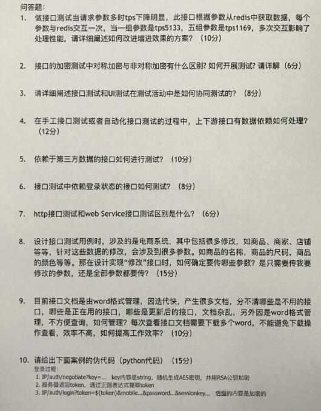
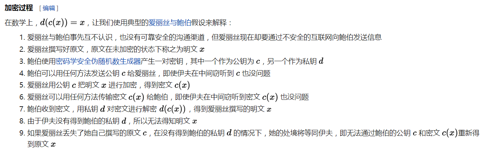

# 面试题解析

### 1

tps就是吞吐量，transaction per second。

吞吐量下降是可能因为频繁访问redis，而频繁访问redis的原因是参数过多，解决的思路很容易想到: **减少参数**。

我们可以把多组参数变成json字符串之类的一个参数，从而达到信息量不减少而参数个数变少的效果。

### 2

对称加密: 信息交换的双方使用同一个密钥加密解密，就像是用同一把钥匙开一把锁

非对称加密

公开密钥加密（英语：Public-key cryptography），也称为非对称加密（英语：asymmetric cryptography），是密码学的一种算法，它需要两个密钥，一个是公开密钥，另一个是私有密钥；一个用作加密的时候，另一个则用作解密。使用其中一个密钥把明文加密后所得的密文，只能用相对应的另一个密钥才能解密得到原本的明文；甚至连最初用来加密的密钥也不能用作解密。由于加密和解密需要两个不同的密钥，故被称为非对称加密；不同于加密和解密都使用同一个密钥的对称加密。虽然两个密钥在数学上相关，但如果知道了其中一个，并不能凭此计算出另外一个；因此其中一个可以公开，称为公钥，任意向外发布；不公开的密钥为私钥，必须由用户自行严格秘密保管，绝不通过任何途径向任何人提供，也不会透露给要通信的另一方，即使他被信任。

基于公开密钥加密的特性，它还提供数字签名的功能，使电子文件可以得到如同在纸本文件上亲笔签署的效果。

如何测试：略

### 3

UI与接口测试的协同可以从下面的方向考虑

* UI的操作实际上就是用另一种方式调用接口，那么接口有多少种参数组合就要求UI用例要构造多少种操作进行调用
* UI操作所需要的数据可以用接口来生成
* 接口测试可以保证数据和逻辑的准确性，UI测试需要考虑交互和界面展示的逻辑正确性
* UI测试需要重视接口调用不成功或者接口异常情况下UI的呈现方式和用户体验
* UI中可能会有一些状态的缓存信息（这样就不需要每次频繁调用接口去获取了），比如鉴权信息等，需要重点关注这些缓存的更新策略

### 4

上下游接口的数据依赖无非就是准备测试数据。

假如一个事务需要顺序调用3个接口，A B C， C依赖于AB， 而AB有数据依赖，这时候就需要准备好A和B的数据。

数据一般有两种方式生成

* 动态方式：假如B依赖A创造的数据，那么每次执行B之前必须执行A去做数据创建

* 静态方式：独立统一的测试数据库, ABC需要的数据都可以从库里拿到

### 5

依赖第三方就mock掉，可以自己写mock server

### 6

依赖登录态，那么每次测试该接口之前都需要调用登录的接口

如果是jwt之类的token based auth的话，每次在调用接口时提供token就可以了

### 7

不知道，感觉出题者的理解可能有点偏差。

### 8

修改的接口，也就是update的接口一般只需要传：**被更新了的字段** 以及 被更新实体的 **主键** 比如id。

这是开发常识，如果大家研究过jsonapi规格的话，可以直接套用jsonapi的设计进行阐述。

### 9

swagger文档可以解决这个问题。

### 10

看不清。

### 总结

这些题里有一半的题目我们上课都有涉及，另一些没有涉及到的是在考察大家的用例设计能力和接口测试的经验。

总的来说题目出的一般，也不算太难，希望这些解答对大家有所帮助。
