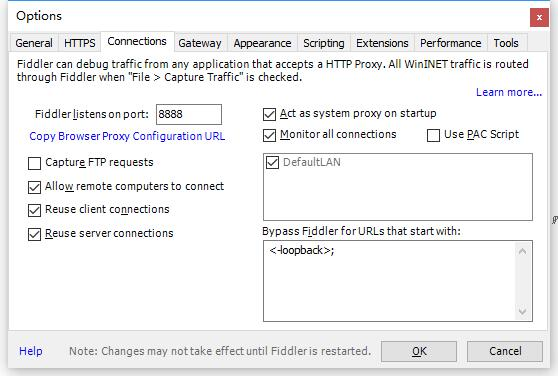

# 抓 APP 的请求

前言

fiddler 在抓手机 app 的请求时候，通常也会抓到来自 PC 的请求，导致会话消息太多，那么如何把来

自 pc 的请求过滤掉，只抓来自 APP 的请求呢？


必备环境：

1.电脑上已装 fiddler

2.手机和电脑在同一局域网

一、设置

1.fiddler>Tools>Fiddler Options>Connections  勾选 Allow remote computers to connect。

2.记住这里的端口号：8888，后面会用到。



二、查看电脑 IP

1.打开 cmd，输入：ipconfig,记住这个地址。

三、设置代理

1.手机设置->WLAN 设置->选择该 wifi，点右边的箭头（有的手机是长按弹出选项框）。

2.选择修改网络配置：

配置主机名：与主机电脑 IP 地址保持一致

端口号：8888

3.保存后就可以抓到来自手机的请求了。

四、抓 APP 上的 HTTPS 请求


1.如果 app 都是 http 请求，是不需要安装证书，能直接抓到的，如果是 https 请求，这时候手机就需要
下载证书了。

2.打开手机浏览器输入：http://10.224.xx.xx:8888  ，这个中间的 host 地址就是前面查到的本机地址。

3.出现如下画面，点箭头所指的位置，点击安装就可以了。

五、设置过滤


1.手机上设置代理后，这时候 fiddler 上抓到的是 pc 和 app 所有的请求，如果 pc 上打开网址，会很多，
这时候就需要开启过滤功能了。

2.打开 fiddler>Tools>Fiddler Options>HTTPS>...from remote clients only,勾选这个选项就可以了

```
...from all processes :抓所有的请求
...from browsers only ：只抓浏览器的请求
...from non-browsers only :只抓非浏览器的请求
...from remote clients only:只抓远程客户端请求
```
（注意：如果手机设置代理后，测完之后记得恢复原样，要不然手机无法正常上网。）
