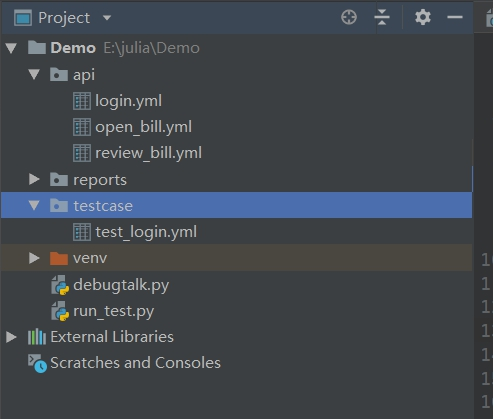
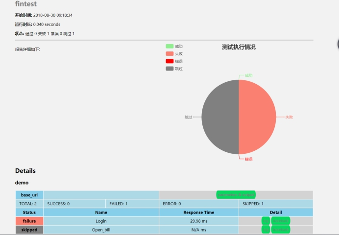
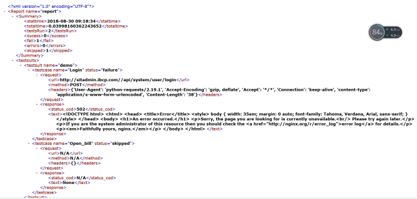

# fintest 使用手册

## 1. 安装fintest

**1.1 进入到fintest目录，打开命令行，输入如下命令**
```
..\python.exe  setup.py  sdist
```
 

**2.1 输入安装命令**
```
..\python.exe  setup.py  install
```
 

## 2. 打开pycharm，新建project项目，结构如下

**2.1 api文件夹存放单个接口文件**
 
**2.2 test case文件夹存放案例**

**3.3 debugtalk.py文件存在yml要调用的函数**



## 3. 导入包，调用执行文件，生成html报告和xml文件

**3.1 导入包**
```
from fintest import task
```

**3.2 调用**
```
if __name__ == '__main__':
    a = task.InterfaceRunner()
    a.run("E:/julia\Demo/testcase/test_login.yml")
    a.gen_html_report("fintest","E:/julia/pytest_framework/Fintest/fintest/templetes/report_template.html")
    a.gen_xml_report("report")
```
**3.3 生成html报告**

 

**3.4 生成xml文件**

 


 