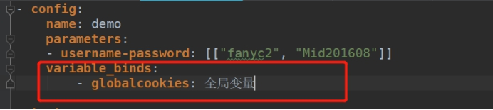
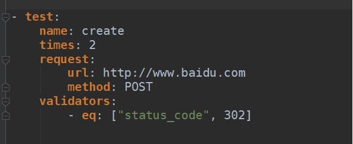

## yml文件的编写：

**1. 测试用例(testcase)文件格式**
```
- test:
    name: test1
    request:
        url: http://sitadmin.ibcp.com//api/system/user/login
        method: POST
        headers:
            content-type: application/x-www-form-urlencoded
        data: username=$UserName&pwd=$Password&pinCode=

    validators:
        - eq: ["status_code", 200]
```

**2. api接口文件格式** 
```
- api:
    def: api_v1_Account_Login_POST($UserName, $Password)
    request:
        url: http://sitadmin.ibcp.com//api/system/user/login
        method: POST
        headers:
            content-type: application/x-www-form-urlencoded

        data: username=$UserName&pwd=$Password&pinCode=

    extractors: [{globalcookies: cookies}]

    validators:
        - eq: ["status_code", 200]
```

**3. 场景用例格式**
```
- config:
    name: demo
    parameters:
    - username-password: [["fanyc2", "Mid201608"]]
    variable_binds:
        - globalcookies: 全局变量

- test:
    name: Login
    api: api_v1_Account_Login_POST($username, $password)

- test:
    name: Open_bill
    api: api_v1_Open_bill()
```
 

## 在config节点下定义全局变量

 

## 在test节点中提取变量并赋值给全局变量

**extractors**: [{**globalcookies**: cookies}]

## 支持多组数据执行

**1. 多维度**
**parameters**:
    \- **username-password**: [["user1", "111111"], ["test2", "222222"]]

**2. 单维度**
**parameters**:
    \- **username**: ["fanyc2","lisx12"]

## 支持一条案例执行多次，由times 属性指定

 

## 跳过当前案例不执行

**skip**: "skip this test unconditionally"
