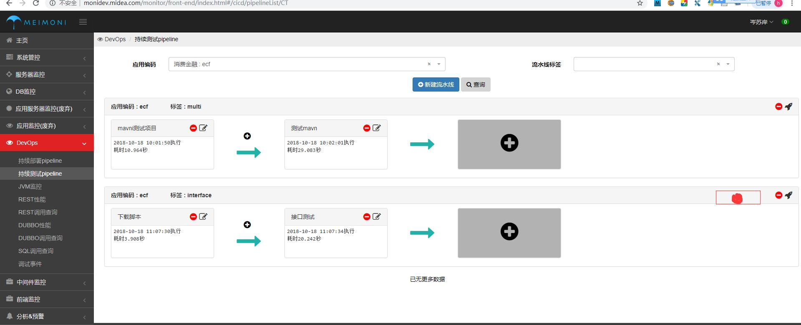
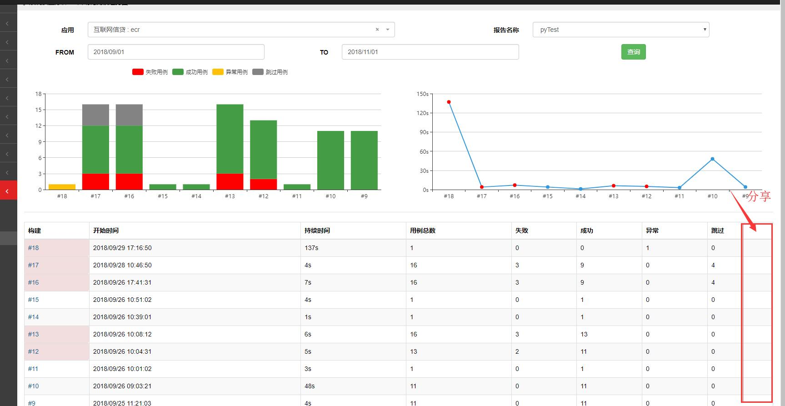
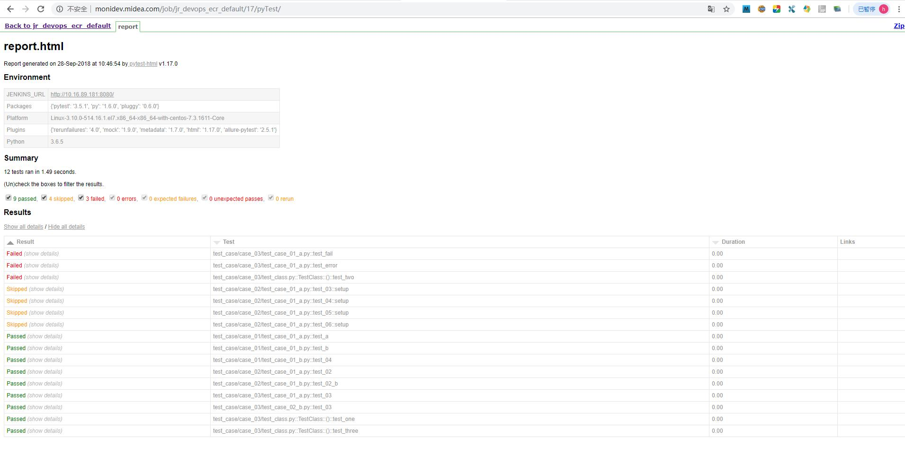
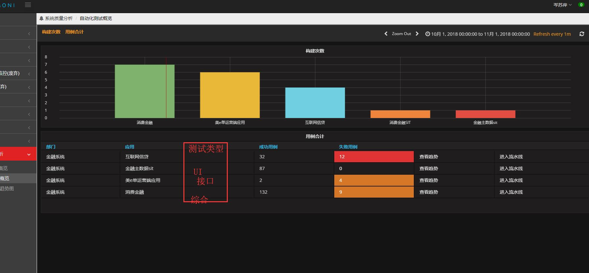

## 二期流水线需求

- 定时任务执行

  

- 提醒通知（邮件）

- 分享页面

  

生成链接

* 概要页面 
  * 增加显示列 【测试类型】取值【标签  】
  * 增加合计行 显示 总数行
* 

* 投影功能

  * 可以生成一个周期，当前项目所有任务的集合统计图，提供一下可以量化视图

  * 每个任务的周期的总数以及成功失败异常路过等

    | 任务     | 构建次数 | 持续时间 | 用例总数 | 失败 | 成功 | 异常 |
    | -------- | -------- | -------- | -------- | ---- | ---- | ---- |
    | pytest   | 10       | 137s     | 10       | 1    | 9    | 0    |
    | report-1 | 2        | 137s     | 100      | 0    | 100  | 0    |
    | report-2 | 10       | 137s     | 57       | 2    | 50   | 5    |

    

* 报告接口（提供线下工具上传报告）

  * pro_id 项目在dev_ops系统中的id代号
  * pro_version 被测对象的唯任务版本号
  * run_time 运行所有脚本花费的时间
    * was_successful 整个过程是否成功
    * total 全部的测试用例总数
    * skipped 跳过的用例数
    * errors 执行出现代码错误的用例数
    * failures 用例判定为失败的用例数 