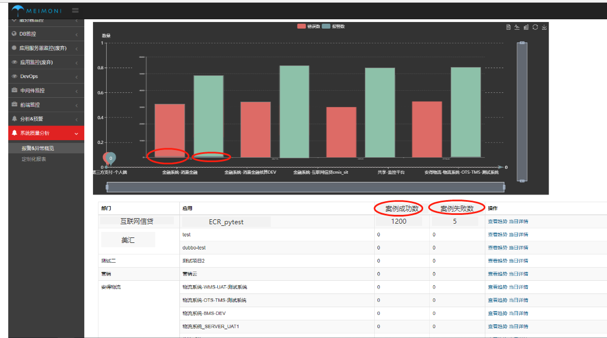
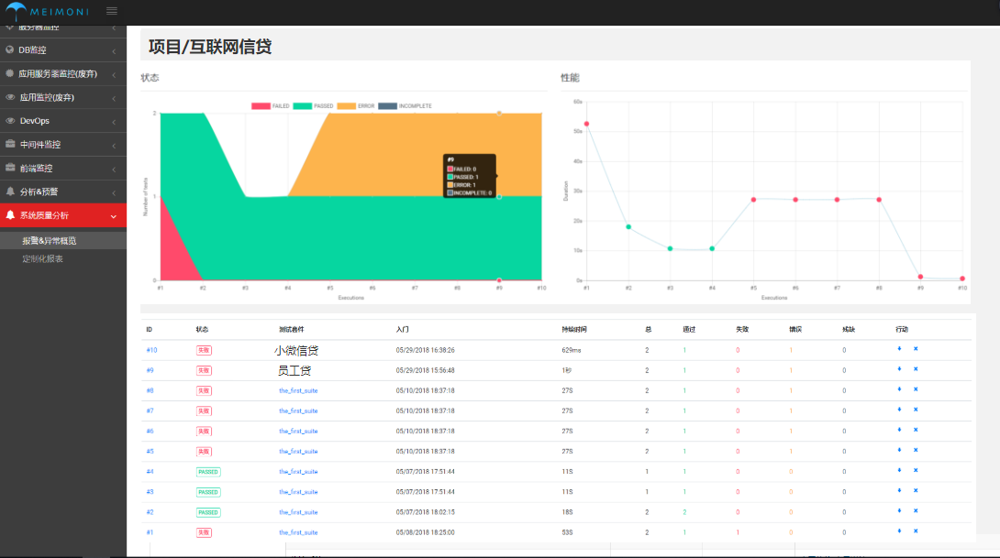
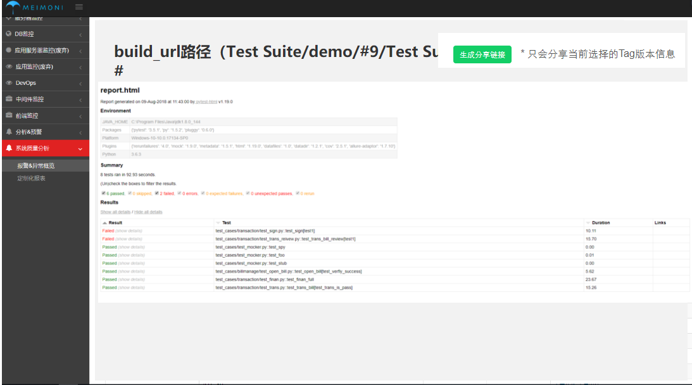

# 质量分析报表

## 各项目自动化运维总表

### 1. 图表显示

- **2个柱形**
    - 构建累计成功数 为绿色
    - 构建累计失败数 为红色 

### 2. 列表内容

- 部门 ==》项目
- 应用 -- 流水线数量
- 案例成功数  =  每次构建用例的成功累计成功数
- 案例失败数  =  每次构建用例的成功累计失败数
- 查看趋势==》跳进项目总图标
- 详情 --跳进流水线执行页面

- 时间区间

## 某项目自动化运维总表

### 1. 图表显示

- **趋势图**
    - 每次构建累计成功数 为绿色
    - 每次构建累计失败数 为红色
    - 每次构建累计异常数 为橙色
    
    - 查询条件：报告，时间
    
- **性能图或叫持续时间**
    - 每次构建使持续时间 成功为绿色，失败为红色

### 2. 列表内容

- ID = 构建ID
- 状态 = xml内容  有失败和异常，状态为失败，为0时，通过
- 测试流水线 = xml内容  **链接可以点击进入执行页面**
- 日期  = xml内容
- 持续时间 = xml内容
- 总数 = xml内容 
- 通过 = xml内容
- 失败 = xml内容
- 异常 = xml内容
- 跳过 = xml内容

    
## 某项目某套件自动化表

### 2. 列表内容

- 表为构建时生成HTML报告
- 生成分享链接  - 即可以点击复制html链接

   