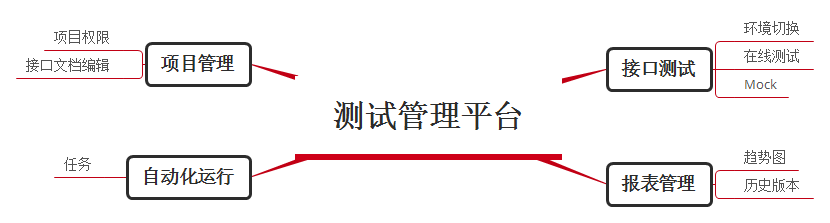

## 测试管理平台

> 项目接口编辑，文档导出，接口测试，用例记录，自动化测试，团队管理等功能，涵盖文档编辑，在线测试，自动化等各种场景，实现一站式测试

- 利用开源的测试管理平台，进行二次开发，定制适合自身需求,目前主流开源项目有：

| 开源项目 | Yapi                | Doclevel        | eoLinker开源版本 | LuckyFrameWeb | PMO测试平台 |
| -------- | ------------------- | --------------- | -------- | ------------- | -------- |
| 前端     | react redux         | vue+element UI  |          | Bootstrap     |  |
| 后端     | koa nodejs mongoose | express+mongodb | java(spring boot + mybatis) | java | python |
| 项目管理     | 支持 | 支持 | 支持  | 支持 | 支持 |
| 数据导入     | swagger, postman, har | postman，rap，swagger | Postman、RAP、RestClint、swagger | 未支持 | har |
| 支持协议     | HTTP/HTTPS | HTTP/HTTPS | HTTP/HTTPS | HTTP/HTTPS | HTTP/HTTPS |
| 在线接口测试     | 支持 | 支持 | 支持  | 支持 | 支持 |
| 自动化测试     | 支持 | 支持 | 支持  | 支持 | 支持 |
| 运行方式     | chrome插件 | chrome插件 | chrome和firfox插件 | 后台运行 | 后台运行 |
| 支持文档分享和导出     | HTML | HTML | HTML、PDF以及Word | 未支持 | 未支持 |
| 
MockServer
 | 支持 | 支持 | 支持  | 支持 | 未支持 |
| 
高级模式（代码）
 | 支持 | 支持 | 未支持 | 未支持 | 未支持 |
| 
内置函数
 | 未支持 | 未支持 | 开源版本未支持 | 未支持 | 未支持 |
| 
UI自动化
 | 不支持 | 不支持 | 不支持 | 不支持 | 不支持 |

----
### Yapi管理平台
[demo链接](http://47.106.115.161:3000/)
[开源地址](https://github.com/YMFE/yapi)

**admin@admin.com/ymfe.org**
平台介绍
    YApi 是高效、易用、功能强大的 api 管理平台，旨在为开发、产品、测试人员提供更优雅的接口管理服务。可以帮助开发者轻松创建、发布、维护 API，YApi 还为用户提供了优秀的交互体验，开发人员只需利用平台提供的接口数据写入工具以及简单的点击操作就可以实现接口的管理。

特性
- 基于 Json5 和 Mockjs 定义接口返回数据的结构和文档，效率提升多倍
- 扁平化权限设计，即保证了大型企业级项目的管理，又保证了易用性
- 类似 postman 的接口调试
- 自动化测试, 支持对 Response 断言
- MockServer 除支持普通的随机 mock 外，还增加了 Mock 期望功能，根据设置的请求过滤规则，返回期望数据
- 支持 postman, har, swagger 数据导入
- 免费开源，内网部署，信息再也不怕泄露了
-内网部署
环境要求
    nodejs（7.6+)
    mongodb（2.6+）
    git

### Doclevel管理平台

[demo链接](http://doclever.cn/controller/read/read.html#5a532f98b7731a2ba86093b3)
[开源地址](https://github.com/sx1989827/DOClever)

**hancen/hancen**
DOClever有哪些功能
- 1.可以对接口信息进行编辑管理，支持get,post,put,delete,patch五种方法，支持http和https协议，并且支持query，body，json，raw，rest，formdata的参数可视化编辑。同时对json可以进行无限层次可视化编辑。并且，状态码，代码注入，markdown文档等附加功能应有尽有。

- 2.接口调试运行，一个都不能少，可以对参数进行加密，从md5到aes一应俱全，返回参数与模型实时分析对比，给出不一致的地方，找出接口可能出现的问题。如果你不想手写文档，那么试试接口的数据生成功能，可以对接口运行的数据一键生成文档信息。

- 3.mock的无缝整合，DOClever自己就是一个mock服务器，当你把接口的开发状态设置成已完成，本地mock便会自动请求真实接口数据，否则返回事先定义好的mock数据。

- 4.支持postman，rap，swagger的导入，方便你做无缝迁移，同时也支持html文件的导出，方便你离线浏览！

- 5.项目版本和接口快照功能并行，你可以为一个项目定义1.0，1.1，1.2版本，并且可以自由的在不同版本间切换回滚，再也不怕接口信息的遗失，同时接口也有快照功能，当你接口开发到一半或者接口需求变更的时候，可以随时查看之前编辑的接口信息。

- 6.自动化测试功能，目前市面上类似平台的接口自动化测试大部分都是伪自动化，对于一个复杂的场景，比如获取验证码，登陆，获取订单列表，获取某个特定订单详情这样一个上下文关联的一系列操作无能为力。而DOClever独创的自动化测试功能，只需要你编写极少量的javascript代码便可以在网页里完成这样一系列操作，同时，DOClever还提供了后台定时批量执行测试用例并把结果发送到团队成员邮箱的功能，你可以及时获取接口的运行状态。

- 7.团队协作功能，很多类似的平台这样的功能是收费的，但是DOClever觉得好东西需要共享出来，你可以新建一个团队，并且把团队内的成员都拉进来，给他们分组，给他们分配相关的项目以及权限，发布团队公告等等。

- 8.DOClever开源免费，支持内网部署，很多公司考虑到数据的安全性，不愿意把接口放到公网上，没有关系，DOClever给出一个方便快捷的解决方案，你可以把平台放到自己的内网上，完全不需要连接外网，同时功能一样也不少，即便是对于产品的升级，DOClever也提供了很便捷的升级方案！

产品文档
http://doclever.cn

DOClever开源
本次开源的是DOClever的内网版本，可以直接部署到内网中，和线上版本在功能上是完全一样的，区别在于：

- 1.线上的系统用了前端和后端两套工程，并且用nginx做了负载均衡，redis做缓存，而内网版本合并为一个工程，直接用node做静态服务器，取消了缓存，这样对于很多中小型团队来说很轻便而且也够用了。

- 2.线上系统在安全性方面做了不少加固处理，而内网版本默认内网是安全的，也为了提高node作为服务器的效率，取消了很多加固处理，如果用户有需要可以自行添加

##  LuckyFrameWeb
[开源地址链接](https://gitee.com/seagull1985/LuckyFrameWeb/wikis/pages?title=%E9%A1%B9%E7%9B%AE%E4%BB%8B%E7%BB%8D&parent=%E9%A1%B9%E7%9B%AE%E4%BF%A1%E6%81%AF)

一.平台特点

- 分布式测试：使用Web-Client的方式，Web端负责基本信息管理展示，Client负责用例执行，任意无限扩展客户端。

- 多途径用例管理：您既可以使用Web端自带的用例管理模块，也可以使用testlink来管理自动化用例。

- 质量管理：Web端不仅仅有用来管理自动化相关的模块，更可以做一些简单的质量数据收集分析以及数据的多图表展示。

- 多线程执行用例：客户端执行用例可以指定线程数量，用例运行更快速。

- 在线编辑用例：专属自动化用例设计结构，使用bootstrap table x_edit插件，更快捷、方便的编辑、调试自动化用例。

- 定时任务调度：支持自定义配置调度任务，包括指定线程数，指定执行客户端，远程执行shell重启tomcat,对jenkins中的项目进行构建等。

- 测试过程监控：客户端运行用例采用命令行的方式，在客户端可以实时查看过程。Web端可以通过任务查询查看测试进度。

- 日志定位：客户端LOG4J+数据库记录测试过程日志，2种方式都可以通过Web端实时查看定位问题。

- 接口+Web UI双纬度自动化：支持接口+Web UI自动化，客户端OS必须为Windows系统，UI自动化采用WebDriver3.0封装，纯关键字驱动，0编码。

- HTTP+Socket接口免编码：完全封装HTTP以及Socket接口，协议模板+纯关键字驱动，免编码，初级测试人员的福音，与其他类似开源工具相比优势明显

- 在线调试用例：直接通过页面的步骤编辑界面调试用例，省心、省力、省脑子，但是不能不要脑子。

- Bootstrap 小清新风格界面：整套Web系统基于Bootstrap风格，以及多种其下的插件，构建清爽界面。

二.平台干了啥？

主要包括了4个方面，第一自动化测试的分层，第二平台框架的扩展性，第三测试的多纬度，第四利用到成熟的开源产品。

首先测试的分层是目前做自动化框架的主流做法，分层的好处就是，每层之间都是独立的，互不影响，又可以互相灵活组装后，形成一个新的测试流程或理测试场景，通常我们会分为四层即框架层，用例层，脚本层，数据层。

第二方面扩展性，满足多个测试场景、多个测试项目、多个网络协议都能应用，而且支持你利用开发语言对测试驱动桩进行开发，这样基本就实现了跟所有接口、协议的无缝测试对接。

第三方面多纬度覆盖目前的主流测试方式，包括所有接口，web ui,移动APP等等。

第四方面利用开源产品，我们选择了webdriver、appium等成熟的测试框架进行集成，并且系统也提供测试过程全链路管理界面，让你有一个更科学、更方便的自动化管理体系。

##  eolinkerAPI接口管理平台
[链接](https://www.eolinker.com/#/) [开源地址](https://github.com/eolinker/eoLinker-AMS-Lite-For-Java)

**734914790@qq.com/hancen**

eoLinker AMS Lite For Java (中文版)
eoLinker是国内最大的在线API接口管理平台，提供自动生成API文档、API自动化测试、Mock测试、团队协作等功能，旨在解决由于前后端分离导致的开发效率低下问题。
目前eoLinker为来自全球的超过2万家企业提供快速、专业、稳定的API管理服务。eoLinker是Google谷歌开发者联盟的合作产品与企业，不定期举办线下交流分享活动促进国内API管理领域的发展。
eoLinker AMS Lite专为10人以内的小型团队设计，接近线上产品的功能，仅适用于个人体验、非营利组织以及教学交流等非商业场景使用。

特性
- 免费且开源，eoLinker拥有强大的免费产品，在过去的一年里面eoLinker已迭代超过300个版本，优化近千功能点，同时秉承开源精神，提供国际化的开源产品（支持中文简体、繁体以及英语），为广大的开发、测试以及管理人员提供专业的产品。

- 同类产品中最强大的API文档管理系统，支持目前HTTP/HTTPS协议以及所有主流请求方式，并且提供了强大的版本管理功能，可以随时随地回滚API信息。同时支持数据库管理、状态码管理、项目文档管理等常用管理功能。

- API接口测试，支持文件、在线、跨域、自动化测试等功能。同时拥有参数构造器，可以对请求参数进行自动构造，加密、分割、随机字符串等功能一应俱全。配合测试用例可以非常方便地对比请求结果与模型，找出API可能出现的问题。

- API自动化测试，eoLinker是目前全球唯一一款支持界面与代码双模式的自动化测试工具。在UI界面模式下，你不需要编写任何代码即可创建数据相互关联的API测试用例（比如注册-登录-检查登陆状况-退出登录）；同时你也可以通过编写Javascript代码来构造复杂的自动化测试场景。这些都极大地简化了开发测试人员的API测试工作，每次开发完成只需要一个键即可自动测试所有API并且生成测试报告，帮助了解项目API的健康状况。

- API Mock测试，提供最强的Mock功能，支持MockJS，支持自动刷新返回结果以及多种返回的结果。同时还支持对API进行请求校验，当参数或值不符合预设的模板时能够及时找出问题所在。

- 支持文档分享和导出，你可以通过eoLinker在线生成接口文档，也可以导出成为HTML、PDF以及Word等，快速分享或发布API信息。

- 支持Postman、RAP、RestClint等数据导入，无需重新录入API信息，一键导入即可切换平台。

- 强大的团队协作功能，你可以通过URL快速邀请成员或者加入某个项目，eoLinker提供了全面的日志追踪以及权限管理功能。

-----
