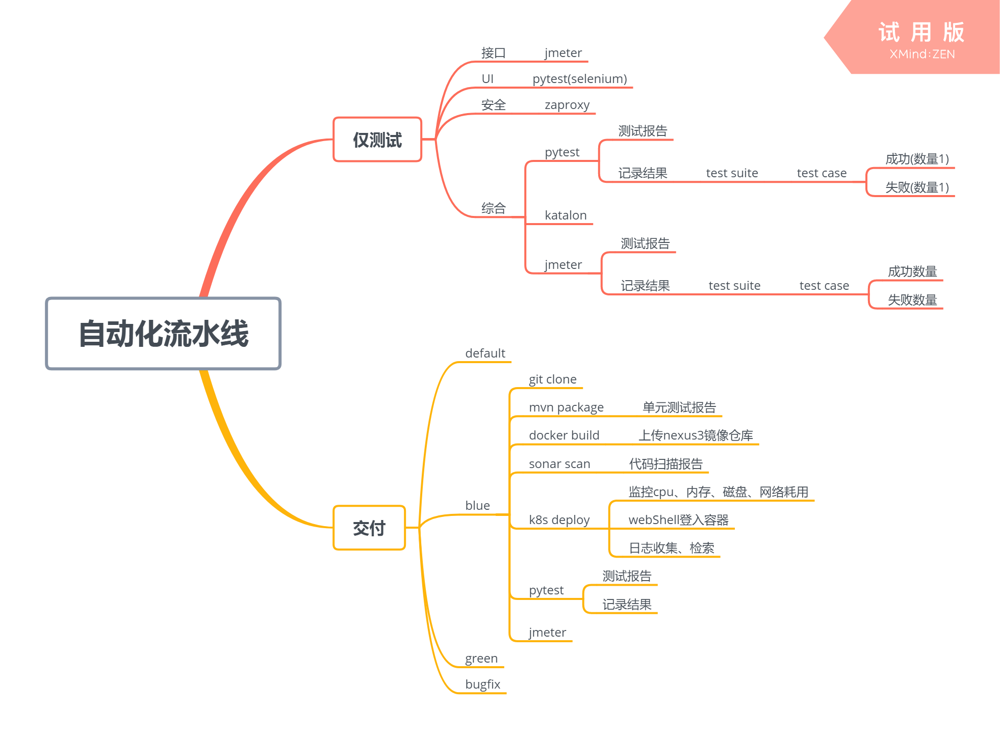
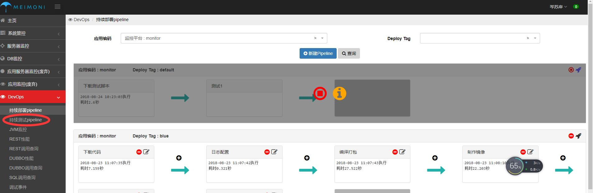
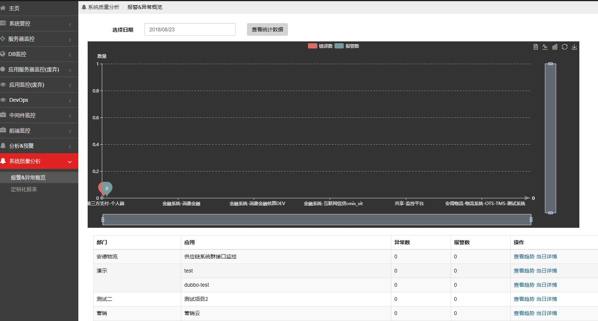

## 1. 项目实施情况

 - 单项目运行
    测试需求分析--脚本开发--环境部署--任务执行---结果分析

## 2.应对方案--统一测试运维平台和持续测试流水线

### 已有DevOps平台(图1)，增加持续测试pipeline的独立功能(图2)即持续测试流水线
1. 测试需求分析
2. 脚本开发
3. 环境部署
  - 动态创建环境
    - 支持pytest,JMeter,katalon环境
4. 任务执行
  - 统一调度方式
5. 结果收集存储
6. 质量分析运维

[持续测试流水线]

[持续测试创建]

[持续测试结果分析]

| 收益项       | 平台实现前                     | 平台实现后                                                   | 收益                                                         |
| ------------ | ------------------------------ | ------------------------------------------------------------ | ------------------------------------------------------------ |
| 推广性       | 各自运维测试                   | 提示统一部署运维的入口                                       | 可以快速推广使用， 测试基于敏捷DevOps体系，紧跟行业潮流      |
| 测试效率提升 | 运行环境，运行设备             | 统一测试运维平台和持续测试流水线                             | 动态生成测试环境减少环境部署， 解决测试人员缺乏环境搭建、部署及数据准备的种种弊端，脱离对运维人员的依赖 |
| 测试结果收集 | 通过手工汇总各项目的执行的结果 | 通过平台收集每次执行的自动收集结果，可通过不同维度查看测试结果 | 直接生成结果，对比报告，效率提升                             |

## 3.下一阶段工作内容：
  - 继续优化自动化测试持续流水线.
  - 加强JMeter工具使用，初始化基本方法，能达到方便使用
  - 给合selenium和HttpWatch工具提供前端UI性能方面的测试，为自动化测试提供多一个度量维度
