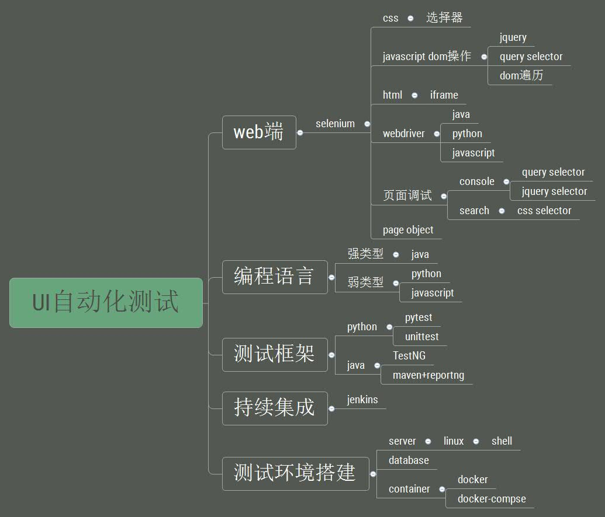

# 简介

### 如何查看python自带的selenium文档

命令行中输入：

```
python -m pydoc -p 12306
```

然后在浏览器中访问[http://localhost:12306](http://localhost:12306/)

按```ctrl+F```搜索**selenium**，点击搜索结果既可查看。

例如，[这个页面](http://localhost:12306/selenium.webdriver.remote.webdriver.html)就是webdriver的remote driver的帮助文档，remote driver包含了webdrier的一些基本功能。

### ui自动化测试知识体系

- 熟练使用一门语言(python/java/javascript)
- selenium
- html/css知识
- javascript/jquery
- 测试框架unittest/pytest/junit
- page object 设计模式
- 持续集成 jenkins


